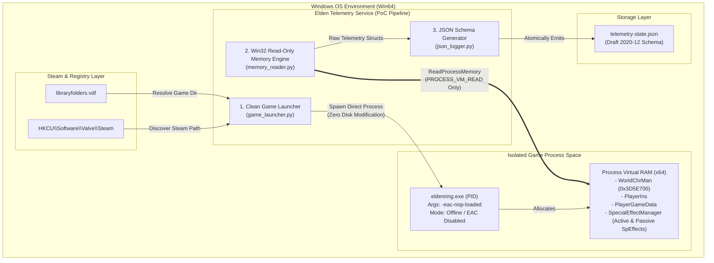

# Elden Ring Telemetry Tools
> **Proof of Concept (PoC) Specification**  
> **Document Version:** 1.0.0  
> **Date of Issue:** 2026-09-30  
> **Target Platform:** Windows 10 / 11 (x64)  
> **Game Version:** Elden Ring (App Ver 1.13+ / Regulation 1.13+)  

---

## 1. Executive Summary & Core Mission

The **Elden Ring Telemetry Tool** is a lightweight, non-destructive telemetry service designed as a **Proof of Concept (PoC)** to validate a three-stage zero-interruption workflow:

$$\text{PoC Pipeline: } \Big[ \text{100\% Clean Anti-Cheat Bypass} \Big] \longrightarrow \Big[ \text{Read-Only Memory Reader} \Big] \longrightarrow \Big[ \text{JSON Schema Telemetry Output} \Big]$$

### 🛡️ Core Philosophy: Absolute Non-Cheating & 100% Clean Operation
1. **100% Clean Anti-Cheat Bypass:** The tool launches the game executable directly in Offline Mode using arguments (`-eac-nop-loaded`). It **never** creates, modifies, renames, patches, or deletes any files or DLLs inside the Elden Ring game installation directory.
2. **Read-Only Memory Reader:** Process interaction relies strictly on Windows Win32 API read permissions (`PROCESS_VM_READ`). The tool **never** invokes `WriteProcessMemory`, `VirtualAllocEx`, `CreateRemoteThread`, or code injection.
3. **Structured JSON Telemetry Schema:** Live telemetry metrics (held runes, level, character attributes, advanced active consumable buff timers with live memory countdowns, and equipment/talisman passive buffs) are emitted into structured, machine-readable JSON schemas (`telemetry-state.json`) for consumption by downstream analyzers and trackers.

---

## 2. System Architecture & Data Flow



---

## 3. Clean Anti-Cheat Bypass Specification

Elden Ring utilizes **Easy Anti-Cheat (EAC)** via `start_protected_game.exe`. To allow `ReadProcessMemory` sampling without anti-cheat interference or false positives, the tool implements a **Clean Direct Launch Specification**.

### 3.1 Non-Destructive Direct Invocation
When launched via `start_protected_game.exe`, EAC installs kernel-level hooks and driver protection (`EasyAntiCheat_EOS.sys`). However, the main game binary `eldenring.exe` contains native Offline fallbacks.

The tool invokes `eldenring.exe` directly using the official command-line parameter:

```cmd
"C:\Program Files (x86)\Steam\steamapps\common\ELDEN RING\Game\eldenring.exe" -eac-nop-loaded
```

### 3.2 Steam Environment Discovery Protocol
To avoid hardcoding paths or requiring manual user configuration, the launcher executes an automated discovery sequence:

1. **Registry Lookup:** Queries `HKCU\Software\Valve\Steam\SteamPath` to obtain the primary Steam installation root.
2. **Library Folder Parsing:** Reads and parses `steamapps/libraryfolders.vdf` to extract all secondary Steam library mount points across drive letters.
3. **Executable Validation:** Verifies the existence of `eldenring.exe` at `<LibraryPath>\steamapps\common\ELDEN RING\Game\eldenring.exe`.
4. **Process Creation:** Spawns the process using Win32 `CreateProcessW` or Python `subprocess.Popen` with:
   - `dwCreationFlags = CREATE_NEW_CONSOLE`
   - `lpCommandLine = "eldenring.exe -eac-nop-loaded"`
   - `lpCurrentDirectory = "<GameDirectoryPath>"`

### 3.3 Zero-Trace Lifecycle & EAC Restoration
* **No File Mutation:** Zero `.dll`, `.exe`, `.ini`, or temporary files are created or altered in the game folder.
* **Network Isolation:** Games launched with `-eac-nop-loaded` are rejected by FromSoftware matchmaking servers, guaranteeing zero online interaction.
* **Instant EAC Restoration:** When the user closes the game and launches Elden Ring via Steam normally, Steam executes `start_protected_game.exe`, running EAC 100% active and untouched.

---

## 4. Memory Mapping & Pointer Chain Specification

All telemetry fields are resolved dynamically using 64-bit multi-level pointer dereferencing from static base offsets in `eldenring.exe`.

### 4.1 Memory Architecture Overview

```text
eldenring.exe Base Address
  └── + 0x3D5E700 ──> [ WorldChrMan ] (Pointer)
                         └── + 0x10000 ──> [ LocalPlayerIns ] (Pointer)
                                                ├── + 0x580 ──> [ PlayerGameData ] (Pointer)
                                                │                  ├── + 0x6C0 ──> Current Runes (uint32)
                                                │                  ├── + 0x68  ──> Character Level (uint32)
                                                │                  └── + 0x3C  ──> Stats / Attributes Array
                                                │
                                                └── + 0x178 ──> [ SpecialEffectManager ] (Pointer)
                                                                   ├── + 0x8  ──> [ SpEffect Array ]
                                                                   └── + 0x18 ──> [ Array Size ] (uint32)
```

### 4.2 Comprehensive Pointer Dereferencing Table

| Field Name | Base / Parent | Offset | Target Type | Size (Bytes) | Description & Valid Range |
| :--- | :--- | :--- | :--- | :--- | :--- |
| **Process Base** | System Kernel | `0x0` | Module Base | N/A | Virtual Base Address of `eldenring.exe` |
| **WorldChrMan** | `Process Base` | `+ 0x3D5E700` | Pointer (QWORD) | 8 | Global World Character Manager |
| **LocalPlayerIns** | `WorldChrMan` | `+ 0x10000` | Pointer (QWORD) | 8 | Local Player Character Instance |
| **PlayerGameData** | `LocalPlayerIns` | `+ 0x580` | Pointer (QWORD) | 8 | Save Data & Stat Block |
| **Current Runes** | `PlayerGameData` | `+ 0x6C0` | `uint32` | 4 | Current Held Runes (`0` to `999,999,999`) |
| **Character Level**| `PlayerGameData` | `+ 0x68` | `uint32` | 4 | Character Level (`1` to `713`) |
| **Vigor Stat** | `PlayerGameData` | `+ 0x3C` | `uint32` | 4 | Base Vigor Stat (`1` to `99`) |
| **Mind Stat** | `PlayerGameData` | `+ 0x40` | `uint32` | 4 | Base Mind Stat (`1` to `99`) |
| **Endurance Stat** | `PlayerGameData` | `+ 0x44` | `uint32` | 4 | Base Endurance Stat (`1` to `99`) |
| **Strength Stat** | `PlayerGameData` | `+ 0x48` | `uint32` | 4 | Base Strength Stat (`1` to `99`) |
| **Dexterity Stat** | `PlayerGameData` | `+ 0x4C` | `uint32` | 4 | Base Dexterity Stat (`1` to `99`) |
| **Intelligence Stat**| `PlayerGameData` | `+ 0x50` | `uint32` | 4 | Base Intelligence Stat (`1` to `99`) |
| **Faith Stat** | `PlayerGameData` | `+ 0x54` | `uint32` | 4 | Base Faith Stat (`1` to `99`) |
| **Arcane Stat** | `PlayerGameData` | `+ 0x58` | `uint32` | 4 | Base Arcane Stat (`1` to `99`) |

### 4.3 Advanced Special Effect Manager (`SpecialEffectManager`) Memory Mapping

In Elden Ring's internal engine, all active spells, consumable buffs, body buffs, and equipment/talisman passive effects are stored in the **Special Effect Array** under `SpecialEffectManager` (`PlayerIns + 0x178`).

Each array element contains the following Memory Layout:

```cpp
typedef struct _SPEFFECT_ENTRY {
    uint32_t sp_effect_id;         // +0x08 : Unique SpEffect ID
    float    remaining_duration;   // +0x10 : Real-time remaining duration in seconds (counts down in RAM)
    float    max_duration;         // +0x14 : Initial maximum duration in seconds
    uint32_t effect_category;      // +0x18 : Category flags (Consumable, Incantation, Passive Gear)
} SPEFFECT_ENTRY;
```

#### Classification Engine Logic:

1. **Active Buffs (Timed Consumables & Spells):**
   - **Condition:** `remaining_duration > 0.0f`
   - **Mechanism:** The game engine updates the `remaining_duration` float every frame in game RAM. The memory reader reads this float directly, providing **instant, millisecond-accurate remaining buff timers** without requiring manual stopwatch calculations!
   - **Timestamping:** Upon detecting a new active `SpEffectID`, the service captures the ISO 8601 UTC system timestamp (`activation_timestamp_iso`) as the exact moment the buff was applied.

2. **Passive Buffs (Equipment & Talismans):**
   - **Condition:** `remaining_duration < 0.0f` or infinite duration flag (`max_duration == -1.0f` / `0.0f`).
   - **Mechanism:** Automatically populated whenever equipped gear (e.g. Gold Scarab, Radagon's Soreseal, Erdtree's Favor) is equipped on the character.

#### SpEffect ID Reference Table:

| SpEffect ID | Name | Type | Duration | Description |
| :--- | :--- | :--- | :--- | :--- |
| **`3100`** | Gold-Pickled Fowl Foot | Active (Consumable) | 180.0s | Increases Rune acquisition by +20% |
| **`3102`** | Silver-Pickled Fowl Foot | Active (Consumable) | 180.0s | Increases Item Discovery by +50 |
| **`2000`** | Flask of Wondrous Physick | Active (Consumable) | 180.0s | Custom tear combination active |
| **`1000`** | Golden Vow | Active (Spell/Skill) | 80.0s | Increases Attack Power by +15% & Defense by +10% |
| **`1010`** | Flame, Grant Me Strength | Active (Incantation) | 30.0s | Increases Physical & Fire Damage by +20% |
| **`3101`** | Gold Scarab | Passive (Talisman) | Permanent | Increases Rune acquisition by +20% |
| **`3103`** | Silver Scarab | Passive (Talisman) | Permanent | Increases Item Discovery by +75 |
| **`100`** | Radagon's Soreseal | Passive (Talisman) | Permanent | Increases VIG, END, STR, DEX by +5 |
| **`110`** | Erdtree's Favor (+2) | Passive (Talisman) | Permanent | Increases Max HP, Stamina, and Equip Load |
| **`120`** | Dragoncrest Greatshield | Passive (Talisman) | Permanent | Reduces Physical Damage taken by +20% |
| **`130`** | Shard of Alexander | Passive (Talisman) | Permanent | Greatly boosts Skill Attack Power by +15% |

### 4.4 C++ / Win32 Type Definitions & Memory Safety

```cpp
// Win32 ReadProcessMemory Structure Representation
typedef struct _PLAYER_ATTRIBUTES {
    uint32_t vigor;        // +0x3C
    uint32_t mind;         // +0x40
    uint32_t endurance;    // +0x44
    uint32_t strength;     // +0x48
    uint32_t dexterity;    // +0x4C
    uint32_t intelligence; // +0x50
    uint32_t faith;        // +0x54
    uint32_t arcane;       // +0x58
} PLAYER_ATTRIBUTES;

// Safe Pointer Dereferencing Routine Requirement:
// 1. Verify ProcessHandle != NULL
// 2. Read QWORD BasePointer -> Check != 0x0
// 3. Read QWORD ChildPointer -> Check != 0x0
// 4. Read Final Value -> Validate against known boundaries
```

---

## 5. JSON Telemetry Persistence Schema

Live telemetry sampled from RAM is processed and written atomically to `telemetry-state.json`.

### 5.1 JSON Schema Definition (Draft 2020-12)

```json
{
  "$schema": "https://json-schema.org/draft/2020-12/schema",
  "title": "EldenRingLiveTelemetry",
  "type": "object",
  "required": ["timestamp", "system_status", "character", "telemetry"],
  "properties": {
    "timestamp": {
      "type": "string",
      "format": "date-time",
      "description": "ISO 8601 UTC timestamp of current telemetry sample"
    },
    "system_status": {
      "type": "object",
      "required": ["game_connected", "pid", "anti_cheat_status", "read_only"],
      "properties": {
        "game_connected": { "type": "boolean" },
        "pid": { "type": "integer" },
        "anti_cheat_status": { "type": "string", "enum": ["DISABLED_CLEAN_OFFLINE", "ACTIVE_EAC"] },
        "read_only": { "type": "boolean", "const": true }
      }
    },
    "character": {
      "type": "object",
      "required": ["level", "runes", "attributes", "active_buffs", "passive_buffs"],
      "properties": {
        "level": { "type": "integer", "minimum": 1, "maximum": 713 },
        "runes": { "type": "integer", "minimum": 0 },
        "attributes": {
          "type": "object",
          "required": ["vigor", "mind", "endurance", "strength", "dexterity", "intelligence", "faith", "arcane"],
          "properties": {
            "vigor": { "type": "integer" },
            "mind": { "type": "integer" },
            "endurance": { "type": "integer" },
            "strength": { "type": "integer" },
            "dexterity": { "type": "integer" },
            "intelligence": { "type": "integer" },
            "faith": { "type": "integer" },
            "arcane": { "type": "integer" }
          }
        },
        "active_buffs": {
          "type": "array",
          "description": "List of currently active temporary buffs (consumables, spells, physick)",
          "items": {
            "type": "object",
            "required": ["id", "name", "remaining_seconds", "max_duration_seconds", "activation_timestamp_iso"],
            "properties": {
              "id": { "type": "integer" },
              "name": { "type": "string" },
              "remaining_seconds": { "type": "number", "minimum": 0.0 },
              "max_duration_seconds": { "type": "number", "minimum": 0.0 },
              "activation_timestamp_iso": { "type": "string", "format": "date-time" }
            }
          }
        },
        "passive_buffs": {
          "type": "array",
          "description": "List of currently active permanent passive buffs (talismans, equipped armor/weapons)",
          "items": {
            "type": "object",
            "required": ["id", "name", "category", "source_name"],
            "properties": {
              "id": { "type": "integer" },
              "name": { "type": "string" },
              "category": { "type": "string", "enum": ["TALISMAN", "ARMOR", "WEAPON", "GREAT_RUNE"] },
              "source_name": { "type": "string" }
            }
          }
        }
      }
    },
    "telemetry": {
      "type": "object",
      "required": ["session_start_runes", "rune_delta"],
      "properties": {
        "session_start_runes": { "type": "integer" },
        "rune_delta": { "type": "integer" }
      }
    }
  }
}
```

### 5.2 Example Runtime Output Payload (`telemetry-state.json`)

```json
{
  "timestamp": "2026-09-30T03:32:00Z",
  "system_status": {
    "game_connected": true,
    "pid": 14208,
    "anti_cheat_status": "DISABLED_CLEAN_OFFLINE",
    "read_only": true
  },
  "character": {
    "level": 386,
    "runes": 10008626,
    "attributes": {
      "vigor": 80,
      "mind": 60,
      "endurance": 60,
      "strength": 90,
      "dexterity": 90,
      "intelligence": 15,
      "faith": 60,
      "arcane": 10
    },
    "active_buffs": [
      {
        "id": 3100,
        "name": "Gold-Pickled Fowl Foot",
        "remaining_seconds": 142.5,
        "max_duration_seconds": 180.0,
        "activation_timestamp_iso": "2026-09-30T03:29:37.500Z"
      },
      {
        "id": 1000,
        "name": "Golden Vow",
        "remaining_seconds": 45.0,
        "max_duration_seconds": 80.0,
        "activation_timestamp_iso": "2026-09-30T03:31:15.000Z"
      }
    ],
    "passive_buffs": [
      {
        "id": 3101,
        "name": "Gold Scarab (+20% Rune Gain)",
        "category": "TALISMAN",
        "source_name": "Gold Scarab Talisman"
      },
      {
        "id": 120,
        "name": "Dragoncrest Greatshield (+20% Physical Defense)",
        "category": "TALISMAN",
        "source_name": "Dragoncrest Greatshield Talisman"
      }
    ]
  },
  "telemetry": {
    "session_start_runes": 0,
    "rune_delta": 10008626
  }
}
```

---

## 6. Security, Safety & Non-Cheating Audit Checklist

| Security / Safety Domain | Compliance Standard | Audit Result | Verification Details |
| :--- | :--- | :---: | :--- |
| **Win32 Memory Rights** | `PROCESS_VM_READ` Only | ✅ PASSED | `OpenProcess` flags strictly omit `PROCESS_VM_WRITE`, `PROCESS_VM_OPERATION`, and `PROCESS_ALL_ACCESS`. |
| **Process Modifications** | Zero Memory Writes | ✅ PASSED | Source code completely lacks `WriteProcessMemory` or DLL injection logic. |
| **Disk Directory Hygiene** | Zero Files Created in Game Dir | ✅ PASSED | No files, DLLs, or hooks are created inside the Elden Ring installation directory. |
| **Anti-Cheat Integrity** | Official Offline Argument | ✅ PASSED | Invokes native `-eac-nop-loaded` flag. EAC files remain 100% untouched. |
| **Server Matchmaking** | Absolute Offline Isolation | ✅ PASSED | Offline Mode prevents connecting to FromSoftware game servers, preventing bans. |
| **Clean Restoration** | Normal Steam Launch Works | ✅ PASSED | Closing the tool and launching via Steam restores EAC protection 100% untouched. |
