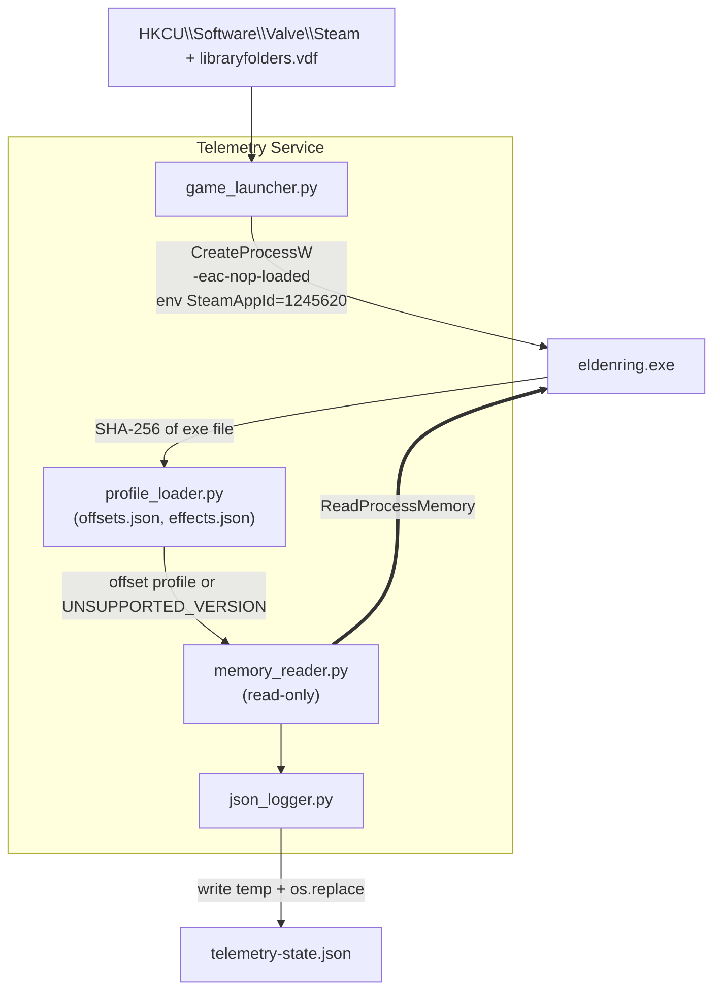

# Elden Ring Telemetry Tool
> **Proof of Concept (PoC) Specification**
> **Document Version:** 1.1.0 (revised from 1.0.0)
> **Date of Issue:** 2026-09-30
> **Target Platform:** Windows 10 / 11 (x64), Python 3.11+ (64-bit)
> **Game:** Elden Ring (Steam). Supported exe versions are listed in `offsets.json` (see §4.1)

---

## 0. Changelog (1.0.0 → 1.1.0)

| # | Change | Reason |
|---|---|---|
| 1 | "Anti-Cheat Bypass" renamed **Offline Launch** | The tool does not bypass anything; it starts the game offline with EAC not loaded |
| 2 | Runes offset `+0x6C0` → **`+0x6C`** | `0x6C0` was a typo; level is `+0x68`, runes `+0x6C` |
| 3 | Hardcoded offsets → **`offsets.json` keyed by exe SHA-256** | Static offsets change on every game patch |
| 4 | Unverified offsets marked **VERIFY** and gated by §7 checklist | `WorldChrMan → PlayerIns` and SpEffect layout must be confirmed on the target exe, not assumed |
| 5 | Flat SpEffect array with `effect_category` **removed** | The engine stores effects as a linked list and has no category field |
| 6 | Passive buffs classified by **ID lookup table** (`effects.json`), not by memory flags | Deterministic; table is generated from game params |
| 7 | `steam_appid.txt` replaced by **`SteamAppId` env var** | Keeps the zero-files-in-game-dir guarantee |
| 8 | `activation_timestamp_iso` computed from `max − remaining` | Correct even if the tool starts while a buff is already running |
| 9 | Added connection state machine + **"never emit unverified data"** rule | Title screen, loading screens and unknown versions must not produce garbage |
| 10 | Fake SpEffect IDs removed from the spec | IDs come from `SpEffectParam`, not from this document |

---

## 1. Executive Summary

A lightweight, **read-only** telemetry service for **offline** Elden Ring sessions:

```
[ Offline Launcher ] → [ Read-Only Memory Reader (version-pinned) ] → [ JSON Telemetry Output ]
```

### Guarantees
1. **Offline only.** The game is started by running `eldenring.exe -eac-nop-loaded` directly. EAC is not loaded and online play is unavailable. The tool refuses to attach to any process it did not launch or that shows EAC modules loaded (§3.4).
2. **Read-only.** Only `PROCESS_VM_READ | PROCESS_QUERY_LIMITED_INFORMATION` is requested. No `WriteProcessMemory`, `VirtualAllocEx`, `CreateRemoteThread`, or injection.
3. **Zero disk changes in the game folder.** No file is created, modified, renamed, or deleted there. (Reading `eldenring.exe` to hash it is read-only.)
4. **Correct-or-silent.** If the exe version is unknown or any validation fails, the tool reports a status and emits **no** character data.

---

## 2. Architecture



---

## 3. Offline Launcher

### 3.1 Command
```cmd
"<GameDir>\eldenring.exe" -eac-nop-loaded
```
`<GameDir>` is `...\steamapps\common\ELDEN RING\Game`.

### 3.2 Discovery
1. Read `HKCU\Software\Valve\Steam\SteamPath`.
2. Parse `<SteamPath>\steamapps\libraryfolders.vdf` for all library paths.
3. Pick the library where `steamapps\common\ELDEN RING\Game\eldenring.exe` exists.
4. Steam client must already be running (required for Steam API init).

### 3.3 Process creation
- `CreateProcessW` with `lpApplicationName` = full exe path, `lpCommandLine` = `"eldenring.exe" -eac-nop-loaded`, `lpCurrentDirectory` = `<GameDir>`.
- Child environment: copy of current env plus `SteamAppId=1245620` and `SteamGameId=1245620`. This satisfies Steam API init **without** creating `steam_appid.txt`.
- The PID returned by `CreateProcessW` is the game PID. The tool only attaches to this PID.
- **Fallback (only if V-01 fails):** the user creates `steam_appid.txt` manually; the tool itself never writes to the game folder.

### 3.4 Safety checks before attaching
- Enumerate modules with `CreateToolhelp32Snapshot(TH32CS_SNAPMODULE | TH32CS_SNAPMODULE32, pid)`. If any module name contains `EasyAntiCheat`, abort with `EAC_DETECTED` and never read memory.
- If the user starts the game via Steam normally (EAC active), the tool must not attach. It reports `EAC_ACTIVE` and exits the read loop.

### 3.5 Restoration
Nothing to restore. Launching from Steam normally runs `start_protected_game.exe` with EAC untouched.

---

## 4. Memory Reading

### 4.1 Version pinning (`offsets.json`)
On attach, compute SHA-256 of `eldenring.exe` and look it up:

```json
{
  "profiles": {
    "<sha256-of-exe>": {
      "label": "ER <version>",
      "world_chr_man_rva": "0x........",
      "world_chr_man_to_player": "0x........",
      "player_to_game_data": "0x580",
      "player_to_sp_effect": "0x178",
      "game_data": { "level": "0x68", "runes": "0x6C", "attributes": "0x3C" },
      "sp_effect": { "head": "0x8", "entry": { "id": "0x..", "next": "0x..", "duration": "0x..", "timer": "0x..", "timer_mode": "elapsed|remaining" } }
    }
  }
}
```
- Unknown hash → status `UNSUPPORTED_VERSION`, no reads beyond module base.
- Adding support for a new patch = add one profile (see §7), no code change.
- Values in the table below marked **VERIFY** are community-known but must be confirmed on the exact exe before the profile is committed.

### 4.2 Pointer chain

```text
eldenring.exe base
 └─ + world_chr_man_rva ─────────► [WorldChrMan]              (RVA changes per version, in profile)
     └─ + world_chr_man_to_player ─► [PlayerIns]              (changes per version, in profile)
         ├─ + 0x580 ─► [PlayerGameData]                       (VERIFY)
         │     ├─ + 0x68  Level    (uint32)
         │     ├─ + 0x6C  Runes    (uint32)
         │     └─ + 0x3C  Attributes (8 × uint32)
         └─ + 0x178 ─► [SpecialEffect]                        (VERIFY)
               └─ + 0x8 ─► head of linked list of entries
```

### 4.3 Field table

| Field | Parent | Offset | Type | Valid range | Status |
|---|---|---|---|---|---|
| WorldChrMan | module base | profile `world_chr_man_rva` | ptr64 | non-null, user-space | per-version |
| PlayerIns | WorldChrMan | profile `world_chr_man_to_player` | ptr64 | non-null, user-space | per-version |
| PlayerGameData | PlayerIns | `+0x580` | ptr64 | non-null, user-space | VERIFY |
| Level | PlayerGameData | `+0x68` | uint32 | 1–713 | stable |
| Runes | PlayerGameData | `+0x6C` | uint32 | 0–999,999,999 | stable |
| Vigor | PlayerGameData | `+0x3C` | uint32 | 1–99 | stable |
| Mind | PlayerGameData | `+0x40` | uint32 | 1–99 | stable |
| Endurance | PlayerGameData | `+0x44` | uint32 | 1–99 | stable |
| Strength | PlayerGameData | `+0x48` | uint32 | 1–99 | stable |
| Dexterity | PlayerGameData | `+0x4C` | uint32 | 1–99 | stable |
| Intelligence | PlayerGameData | `+0x50` | uint32 | 1–99 | stable |
| Faith | PlayerGameData | `+0x54` | uint32 | 1–99 | stable |
| Arcane | PlayerGameData | `+0x58` | uint32 | 1–99 | stable |

"Stable" means unchanged across recent versions in community tables; still confirmed by V-03.

### 4.4 Special effects (linked list)

Active effects are a **singly traversable linked list** starting at `SpecialEffect + head`. Each entry provides at least: SpEffect param ID, a timer value, a total duration, and a `next` pointer. Exact entry offsets go in the profile and are confirmed by V-04/V-05.

Traversal rules (all mandatory):
1. Stop when `next == 0`.
2. Hard cap of **512** entries per sample.
3. Cycle detection: stop if a pointer repeats.
4. Every pointer must be in user space (`0x10000 ≤ p < 0x7FFFFFFF0000`) and readable, otherwise abort the sample.

**Timer semantics** are profile-defined (`timer_mode`):
- `remaining`: `remaining = timer`
- `elapsed`: `remaining = duration − timer`

**Classification uses `effects.json`, not memory flags:**
```json
{
  "active":  { "<sp_effect_id>": { "name": "Golden Vow" } },
  "passive": { "<sp_effect_id>": { "name": "Gold Scarab", "category": "TALISMAN", "source_name": "Gold Scarab Talisman" } }
}
```
- ID in `passive` and the effect is present → `passive_buffs`.
- ID in `active`, duration > 0 and remaining > 0 → `active_buffs`.
- Any other ID is ignored (the engine holds many internal effects). Optionally counted in `system_status.ignored_effects`.
- `effects.json` is generated offline from `SpEffectParam` and `EquipParamAccessory` (`refId` → SpEffect ID) using Smithbox or an equivalent param tool. This document deliberately lists **no** SpEffect IDs, because they must come from the game data of the supported version.

**Activation time:** `activation_timestamp_iso = sample_time_utc − (max_duration − remaining)`. Recomputed each sample; stable and correct if the tool starts mid-buff.

### 4.5 Read rules
- Every read goes through `ReadProcessMemory`; treat `ERROR_PARTIAL_COPY` (299) and short reads as "value unavailable", never as zero.
- Validate each pointer (non-null, user-space) and each value against its range. One failed check discards the **entire** sample.
- Polling rate: 10 Hz default (configurable 1–30 Hz).

### 4.6 Connection state machine

| State | Meaning | JSON `character` |
|---|---|---|
| `WAITING_FOR_PROCESS` | Game not running | `null` |
| `EAC_ACTIVE` / `EAC_DETECTED` | EAC present; tool refuses to attach | `null` |
| `UNSUPPORTED_VERSION` | Exe hash not in `offsets.json` | `null` |
| `WAITING_FOR_WORLD` | Process up but pointer chain is null (title screen, loading) | `null` |
| `CONNECTED` | All validations pass | full object |
| `DISCONNECTED` | Process exited | `null` |

`session_start_runes` is captured on the first `CONNECTED` sample of a session, and reset when the process changes.

---

## 5. JSON Output

Written atomically: write `telemetry-state.json.tmp` in the **tool's own output directory** (never the game folder), then `os.replace`. On `PermissionError` (consumer holding the file), retry up to 5 times at 20 ms.

### 5.1 Schema (Draft 2020-12)

```json
{
  "$schema": "https://json-schema.org/draft/2020-12/schema",
  "title": "EldenRingLiveTelemetry",
  "type": "object",
  "required": ["timestamp", "system_status", "character", "telemetry"],
  "properties": {
    "timestamp": { "type": "string", "format": "date-time" },
    "system_status": {
      "type": "object",
      "required": ["state", "game_connected", "pid", "anti_cheat_status", "read_only", "exe_sha256", "profile"],
      "properties": {
        "state": {
          "type": "string",
          "enum": ["WAITING_FOR_PROCESS", "EAC_ACTIVE", "EAC_DETECTED", "UNSUPPORTED_VERSION", "WAITING_FOR_WORLD", "CONNECTED", "DISCONNECTED"]
        },
        "game_connected": { "type": "boolean" },
        "pid": { "type": ["integer", "null"] },
        "anti_cheat_status": { "type": "string", "enum": ["DISABLED_OFFLINE", "ACTIVE_EAC", "UNKNOWN"] },
        "read_only": { "type": "boolean", "const": true },
        "exe_sha256": { "type": ["string", "null"] },
        "profile": { "type": ["string", "null"] },
        "ignored_effects": { "type": "integer", "minimum": 0 }
      }
    },
    "character": {
      "type": ["object", "null"],
      "required": ["level", "runes", "attributes", "active_buffs", "passive_buffs"],
      "properties": {
        "level": { "type": "integer", "minimum": 1, "maximum": 713 },
        "runes": { "type": "integer", "minimum": 0, "maximum": 999999999 },
        "attributes": {
          "type": "object",
          "required": ["vigor", "mind", "endurance", "strength", "dexterity", "intelligence", "faith", "arcane"],
          "additionalProperties": { "type": "integer", "minimum": 1, "maximum": 99 }
        },
        "active_buffs": {
          "type": "array",
          "items": {
            "type": "object",
            "required": ["id", "name", "remaining_seconds", "max_duration_seconds", "activation_timestamp_iso"],
            "properties": {
              "id": { "type": "integer" },
              "name": { "type": "string" },
              "remaining_seconds": { "type": "number", "minimum": 0 },
              "max_duration_seconds": { "type": "number", "exclusiveMinimum": 0 },
              "activation_timestamp_iso": { "type": "string", "format": "date-time" }
            }
          }
        },
        "passive_buffs": {
          "type": "array",
          "items": {
            "type": "object",
            "required": ["id", "name", "category", "source_name"],
            "properties": {
              "id": { "type": "integer" },
              "name": { "type": "string" },
              "category": { "type": "string", "enum": ["TALISMAN", "ARMOR", "WEAPON", "GREAT_RUNE"] },
              "source_name": { "type": "string" }
            }
          }
        }
      }
    },
    "telemetry": {
      "type": "object",
      "required": ["session_start_runes", "rune_delta"],
      "properties": {
        "session_start_runes": { "type": ["integer", "null"] },
        "rune_delta": { "type": ["integer", "null"], "description": "current runes − session_start_runes (negative when spending)" }
      }
    }
  }
}
```

### 5.2 Example (illustrative values; IDs are placeholders)

```json
{
  "timestamp": "2026-09-30T03:32:00Z",
  "system_status": {
    "state": "CONNECTED",
    "game_connected": true,
    "pid": 14208,
    "anti_cheat_status": "DISABLED_OFFLINE",
    "read_only": true,
    "exe_sha256": "<sha256>",
    "profile": "ER <version>",
    "ignored_effects": 37
  },
  "character": {
    "level": 386,
    "runes": 10008626,
    "attributes": { "vigor": 80, "mind": 60, "endurance": 60, "strength": 90, "dexterity": 90, "intelligence": 15, "faith": 60, "arcane": 10 },
    "active_buffs": [
      {
        "id": 0,
        "name": "Golden Vow",
        "remaining_seconds": 45.0,
        "max_duration_seconds": 80.0,
        "activation_timestamp_iso": "2026-09-30T03:31:27.000Z"
      }
    ],
    "passive_buffs": [
      { "id": 0, "name": "Gold Scarab", "category": "TALISMAN", "source_name": "Gold Scarab Talisman" }
    ]
  },
  "telemetry": { "session_start_runes": 9500000, "rune_delta": 508626 }
}
```
(`id: 0` above is a placeholder; real IDs come from `effects.json`.)

---

## 6. Safety Audit Checklist

| Domain | Standard | How it is enforced |
|---|---|---|
| Memory rights | `PROCESS_VM_READ \| PROCESS_QUERY_LIMITED_INFORMATION` only | Single `OpenProcess` call site; unit test asserts the flag mask |
| No writes | No `WriteProcessMemory`, injection, remote threads | Static grep in CI for forbidden API names |
| Game dir hygiene | Zero files created or changed | Test: hash-tree of game dir before and after a session must match |
| EAC | Never attach with EAC loaded | Module scan in §3.4 |
| Online | Offline launch only | `-eac-nop-loaded`; tool does not launch any other mode |
| Data integrity | No unverified data emitted | §4.5 validation and §4.6 state machine |

---

## 7. Verification Checklist (must pass before a profile is committed)

Use Cheat Engine (attach read-only inspection, offline session only) or an equivalent reader on the **exact exe** being profiled.

| ID | Check | Pass criterion |
|---|---|---|
| V-01 | Direct launch with env vars, no `steam_appid.txt` | Game reaches title screen; game dir unchanged. If it fails, use §3.3 fallback |
| V-02 | Find `WorldChrMan` RVA and `WorldChrMan → PlayerIns` offset | Chain resolves to a non-null `PlayerIns` in-world, null on title screen |
| V-03 | `PlayerIns+0x580` → `PlayerGameData`; check `+0x68`, `+0x6C`, `+0x3C..0x58` | Level, runes and 8 attributes match the in-game menu exactly; change by leveling and picking up runes |
| V-04 | `PlayerIns+0x178` → `SpecialEffect` → head; locate `id`, `next`, `duration`, `timer` offsets | Equipping a talisman adds an entry whose ID matches `EquipParamAccessory.refId` |
| V-05 | Determine `timer_mode` | Use a timed buff; timer value moves in a consistent direction; confirm it reaches the buff's param duration |
| V-06 | Full-session soak (30 min: load screens, death, fast travel, quit to menu) | No crash, no out-of-range output; state machine transitions correctly |
| V-07 | Repeat V-02..V-05 after each game patch | Otherwise the exe hash is not in `offsets.json` and the tool reports `UNSUPPORTED_VERSION` |

---

## 8. Scope

**In scope (PoC):** launch offline, resolve chain via profile, emit level, runes, attributes, timed buffs, passive effects, rune delta.

**Out of scope:** online play, EAC interaction, any memory write, save-file editing, automatic offset discovery (future work), other games or platforms.
