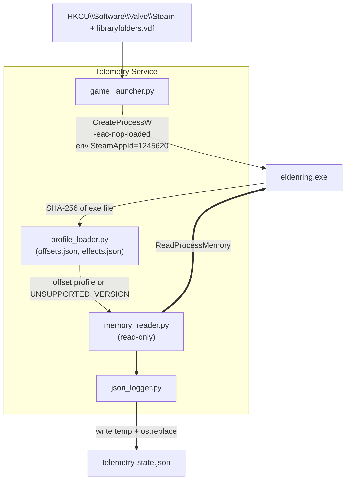

# Elden Ring Telemetry Tool
> **Proof of Concept (PoC) Specification**
> **Document Version:** 1.2.0 (revised from 1.1.0)
> **Date of Issue:** 2026-09-30
> **Target Platform:** Windows 10 / 11 (x64), Python 3.11+ (64-bit)
> **Game:** Elden Ring (Steam). Supported exe versions are listed in `offsets.json` (see §4.1)

---

## 0. Changelog

### 1.1.0 → 1.2.0

| # | Change | Reason |
|---|---|---|
| 1 | §7 rewritten with steps, commands, reference outputs (ER 1.17.1) and pass/fail rules for every check | The checklist said *what* to verify but not *how* |
| 2 | Added profile status **PROVISIONAL** (V-01..V-05) vs **VERIFIED** (V-01..V-06) and a sign-off table (§7.8) | The reference profile passed V-01..V-05 but V-06 is still open |
| 3 | V-03 split into **V-03a** (exact match) and **V-03b** (single-attribute increment) | Repeated attribute values (e.g. mind = endurance = faith) hide swapped offsets |
| 4 | V-02 now records behaviour on the title screen instead of assuming "null" | Not yet observed for quit-to-title |
| 5 | New helper `tools\soak_check.py` for V-06; `run --attach` and `effects [-q]` documented in §7.0 | These commands exist in the implementation but were not in the spec |

### 1.0.0 → 1.1.0

| # | Change | Reason |
|---|---|---|
| 1 | "Anti-Cheat Bypass" renamed **Offline Launch** | The tool does not bypass anything; it starts the game offline with EAC not loaded |
| 2 | Runes offset `+0x6C0` → **`+0x6C`** | `0x6C0` was a typo; level is `+0x68`, runes `+0x6C` |
| 3 | Hardcoded offsets → **`offsets.json` keyed by exe SHA-256** | Static offsets change on every game patch |
| 4 | Unverified offsets marked **VERIFY** and gated by §7 checklist | `WorldChrMan → PlayerIns` and SpEffect layout must be confirmed on the target exe, not assumed |
| 5 | Flat SpEffect array with `effect_category` **removed** | The engine stores effects as a linked list and has no category field |
| 6 | Passive buffs classified by **ID lookup table** (`effects.json`), not by memory flags | Deterministic; table is generated from game params |
| 7 | `steam_appid.txt` replaced by **`SteamAppId` env var** | Keeps the zero-files-in-game-dir guarantee |
| 8 | `activation_timestamp_iso` computed from `max − remaining` | Correct even if the tool starts while a buff is already running |
| 9 | Added connection state machine + **"never emit unverified data"** rule | Title screen, loading screens and unknown versions must not produce garbage |
| 10 | Fake SpEffect IDs removed from the spec | IDs come from `SpEffectParam`, not from this document |

---

## 1. Executive Summary

A lightweight, **read-only** telemetry service for **offline** Elden Ring sessions:

```
[ Offline Launcher ] → [ Read-Only Memory Reader (version-pinned) ] → [ JSON Telemetry Output ]
```

### Guarantees
1. **Offline only.** The game is started by running `eldenring.exe -eac-nop-loaded` directly. EAC is not loaded and online play is unavailable. The tool refuses to attach to any process it did not launch or that shows EAC modules loaded (§3.4).
2. **Read-only.** Only `PROCESS_VM_READ | PROCESS_QUERY_LIMITED_INFORMATION` is requested. No `WriteProcessMemory`, `VirtualAllocEx`, `CreateRemoteThread`, or injection.
3. **Zero disk changes in the game folder.** No file is created, modified, renamed, or deleted there. (Reading `eldenring.exe` to hash it is read-only.)
4. **Correct-or-silent.** If the exe version is unknown or any validation fails, the tool reports a status and emits **no** character data.

---

## 2. Architecture



---

## 3. Offline Launcher

### 3.1 Command
```cmd
"<GameDir>\eldenring.exe" -eac-nop-loaded
```
`<GameDir>` is `...\steamapps\common\ELDEN RING\Game`.

### 3.2 Discovery
1. Read `HKCU\Software\Valve\Steam\SteamPath`.
2. Parse `<SteamPath>\steamapps\libraryfolders.vdf` for all library paths.
3. Pick the library where `steamapps\common\ELDEN RING\Game\eldenring.exe` exists.
4. Steam client must already be running (required for Steam API init).

### 3.3 Process creation
- `CreateProcessW` with `lpApplicationName` = full exe path, `lpCommandLine` = `"eldenring.exe" -eac-nop-loaded`, `lpCurrentDirectory` = `<GameDir>`.
- Child environment: copy of current env plus `SteamAppId=1245620` and `SteamGameId=1245620`. This satisfies Steam API init **without** creating `steam_appid.txt`.
- The PID returned by `CreateProcessW` is the game PID. The tool only attaches to this PID.
- **Fallback (only if V-01 fails):** the user creates `steam_appid.txt` manually; the tool itself never writes to the game folder.

### 3.4 Safety checks before attaching
- Enumerate modules with `CreateToolhelp32Snapshot(TH32CS_SNAPMODULE | TH32CS_SNAPMODULE32, pid)`. If any module name contains `EasyAntiCheat`, abort with `EAC_DETECTED` and never read memory.
- If the user starts the game via Steam normally (EAC active), the tool must not attach. It reports `EAC_ACTIVE` and exits the read loop.

### 3.5 Restoration
Nothing to restore. Launching from Steam normally runs `start_protected_game.exe` with EAC untouched.

---

## 4. Memory Reading

### 4.1 Version pinning (`offsets.json`)
On attach, compute SHA-256 of `eldenring.exe` and look it up:

```json
{
  "profiles": {
    "<sha256-of-exe>": {
      "label": "ER <version>",
      "world_chr_man_rva": "0x........",
      "world_chr_man_to_player": "0x........",
      "player_to_game_data": "0x580",
      "player_to_sp_effect": "0x178",
      "game_data": { "level": "0x68", "runes": "0x6C", "attributes": "0x3C" },
      "sp_effect": { "head": "0x8", "entry": { "id": "0x..", "next": "0x..", "duration": "0x..", "timer": "0x..", "timer_mode": "elapsed|remaining" } }
    }
  }
}
```
- Unknown hash → status `UNSUPPORTED_VERSION`, no reads beyond module base.
- Adding support for a new patch = add one profile (see §7), no code change.
- Values in the table below marked **VERIFY** are community-known but must be confirmed on the exact exe before the profile is committed.

### 4.2 Pointer chain

```text
eldenring.exe base
 └─ + world_chr_man_rva ─────────► [WorldChrMan]              (RVA changes per version, in profile)
     └─ + world_chr_man_to_player ─► [PlayerIns]              (changes per version, in profile)
         ├─ + 0x580 ─► [PlayerGameData]                       (VERIFY)
         │     ├─ + 0x68  Level    (uint32)
         │     ├─ + 0x6C  Runes    (uint32)
         │     └─ + 0x3C  Attributes (8 × uint32)
         └─ + 0x178 ─► [SpecialEffect]                        (VERIFY)
               └─ + 0x8 ─► head of linked list of entries
```

### 4.3 Field table

| Field | Parent | Offset | Type | Valid range | Status |
|---|---|---|---|---|---|
| WorldChrMan | module base | profile `world_chr_man_rva` | ptr64 | non-null, user-space | per-version |
| PlayerIns | WorldChrMan | profile `world_chr_man_to_player` | ptr64 | non-null, user-space | per-version |
| PlayerGameData | PlayerIns | `+0x580` | ptr64 | non-null, user-space | VERIFY |
| Level | PlayerGameData | `+0x68` | uint32 | 1–713 | stable |
| Runes | PlayerGameData | `+0x6C` | uint32 | 0–999,999,999 | stable |
| Vigor | PlayerGameData | `+0x3C` | uint32 | 1–99 | stable |
| Mind | PlayerGameData | `+0x40` | uint32 | 1–99 | stable |
| Endurance | PlayerGameData | `+0x44` | uint32 | 1–99 | stable |
| Strength | PlayerGameData | `+0x48` | uint32 | 1–99 | stable |
| Dexterity | PlayerGameData | `+0x4C` | uint32 | 1–99 | stable |
| Intelligence | PlayerGameData | `+0x50` | uint32 | 1–99 | stable |
| Faith | PlayerGameData | `+0x54` | uint32 | 1–99 | stable |
| Arcane | PlayerGameData | `+0x58` | uint32 | 1–99 | stable |

"Stable" means unchanged across recent versions in community tables; still confirmed by V-03.

### 4.4 Special effects (linked list)

Active effects are a **singly traversable linked list** starting at `SpecialEffect + head`. Each entry provides at least: SpEffect param ID, a timer value, a total duration, and a `next` pointer. Exact entry offsets go in the profile and are confirmed by V-04/V-05.

Traversal rules (all mandatory):
1. Stop when `next == 0`.
2. Hard cap of **512** entries per sample.
3. Cycle detection: stop if a pointer repeats.
4. Every pointer must be in user space (`0x10000 ≤ p < 0x7FFFFFFF0000`) and readable, otherwise abort the sample.

**Timer semantics** are profile-defined (`timer_mode`):
- `remaining`: `remaining = timer`
- `elapsed`: `remaining = duration − timer`

**Classification uses `effects.json`, not memory flags:**
```json
{
  "active":  { "<sp_effect_id>": { "name": "Golden Vow" } },
  "passive": { "<sp_effect_id>": { "name": "Gold Scarab", "category": "TALISMAN", "source_name": "Gold Scarab Talisman" } }
}
```
- ID in `passive` and the effect is present → `passive_buffs`.
- ID in `active`, duration > 0 and remaining > 0 → `active_buffs`.
- Any other ID is ignored (the engine holds many internal effects). Optionally counted in `system_status.ignored_effects`.
- `effects.json` is generated offline from `SpEffectParam` and `EquipParamAccessory` (`refId` → SpEffect ID) using Smithbox or an equivalent param tool. This document deliberately lists **no** SpEffect IDs, because they must come from the game data of the supported version.

**Activation time:** `activation_timestamp_iso = sample_time_utc − (max_duration − remaining)`. Recomputed each sample; stable and correct if the tool starts mid-buff.

### 4.5 Read rules
- Every read goes through `ReadProcessMemory`; treat `ERROR_PARTIAL_COPY` (299) and short reads as "value unavailable", never as zero.
- Validate each pointer (non-null, user-space) and each value against its range. One failed check discards the **entire** sample.
- Polling rate: 10 Hz default (configurable 1–30 Hz).

### 4.6 Connection state machine

| State | Meaning | JSON `character` |
|---|---|---|
| `WAITING_FOR_PROCESS` | Game not running | `null` |
| `EAC_ACTIVE` / `EAC_DETECTED` | EAC present; tool refuses to attach | `null` |
| `UNSUPPORTED_VERSION` | Exe hash not in `offsets.json` | `null` |
| `WAITING_FOR_WORLD` | Process up but pointer chain is null (title screen, loading) | `null` |
| `CONNECTED` | All validations pass | full object |
| `DISCONNECTED` | Process exited | `null` |

`session_start_runes` is captured on the first `CONNECTED` sample of a session, and reset when the process changes.

---

## 5. JSON Output

Written atomically: write `telemetry-state.json.tmp` in the **tool's own output directory** (never the game folder), then `os.replace`. On `PermissionError` (consumer holding the file), retry up to 5 times at 20 ms.

### 5.1 Schema (Draft 2020-12)

```json
{
  "$schema": "https://json-schema.org/draft/2020-12/schema",
  "title": "EldenRingLiveTelemetry",
  "type": "object",
  "required": ["timestamp", "system_status", "character", "telemetry"],
  "properties": {
    "timestamp": { "type": "string", "format": "date-time" },
    "system_status": {
      "type": "object",
      "required": ["state", "game_connected", "pid", "anti_cheat_status", "read_only", "exe_sha256", "profile"],
      "properties": {
        "state": {
          "type": "string",
          "enum": ["WAITING_FOR_PROCESS", "EAC_ACTIVE", "EAC_DETECTED", "UNSUPPORTED_VERSION", "WAITING_FOR_WORLD", "CONNECTED", "DISCONNECTED"]
        },
        "game_connected": { "type": "boolean" },
        "pid": { "type": ["integer", "null"] },
        "anti_cheat_status": { "type": "string", "enum": ["DISABLED_OFFLINE", "ACTIVE_EAC", "UNKNOWN"] },
        "read_only": { "type": "boolean", "const": true },
        "exe_sha256": { "type": ["string", "null"] },
        "profile": { "type": ["string", "null"] },
        "ignored_effects": { "type": "integer", "minimum": 0 }
      }
    },
    "character": {
      "type": ["object", "null"],
      "required": ["level", "runes", "attributes", "active_buffs", "passive_buffs"],
      "properties": {
        "level": { "type": "integer", "minimum": 1, "maximum": 713 },
        "runes": { "type": "integer", "minimum": 0, "maximum": 999999999 },
        "attributes": {
          "type": "object",
          "required": ["vigor", "mind", "endurance", "strength", "dexterity", "intelligence", "faith", "arcane"],
          "additionalProperties": { "type": "integer", "minimum": 1, "maximum": 99 }
        },
        "active_buffs": {
          "type": "array",
          "items": {
            "type": "object",
            "required": ["id", "name", "remaining_seconds", "max_duration_seconds", "activation_timestamp_iso"],
            "properties": {
              "id": { "type": "integer" },
              "name": { "type": "string" },
              "remaining_seconds": { "type": "number", "minimum": 0 },
              "max_duration_seconds": { "type": "number", "exclusiveMinimum": 0 },
              "activation_timestamp_iso": { "type": "string", "format": "date-time" }
            }
          }
        },
        "passive_buffs": {
          "type": "array",
          "items": {
            "type": "object",
            "required": ["id", "name", "category", "source_name"],
            "properties": {
              "id": { "type": "integer" },
              "name": { "type": "string" },
              "category": { "type": "string", "enum": ["TALISMAN", "ARMOR", "WEAPON", "GREAT_RUNE"] },
              "source_name": { "type": "string" }
            }
          }
        }
      }
    },
    "telemetry": {
      "type": "object",
      "required": ["session_start_runes", "rune_delta"],
      "properties": {
        "session_start_runes": { "type": ["integer", "null"] },
        "rune_delta": { "type": ["integer", "null"], "description": "current runes − session_start_runes (negative when spending)" }
      }
    }
  }
}
```

### 5.2 Example (illustrative values; IDs are placeholders)

```json
{
  "timestamp": "2026-09-30T03:32:00Z",
  "system_status": {
    "state": "CONNECTED",
    "game_connected": true,
    "pid": 14208,
    "anti_cheat_status": "DISABLED_OFFLINE",
    "read_only": true,
    "exe_sha256": "<sha256>",
    "profile": "ER <version>",
    "ignored_effects": 37
  },
  "character": {
    "level": 386,
    "runes": 10008626,
    "attributes": { "vigor": 80, "mind": 60, "endurance": 60, "strength": 90, "dexterity": 90, "intelligence": 15, "faith": 60, "arcane": 10 },
    "active_buffs": [
      {
        "id": 0,
        "name": "Golden Vow",
        "remaining_seconds": 45.0,
        "max_duration_seconds": 80.0,
        "activation_timestamp_iso": "2026-09-30T03:31:27.000Z"
      }
    ],
    "passive_buffs": [
      { "id": 0, "name": "Gold Scarab", "category": "TALISMAN", "source_name": "Gold Scarab Talisman" }
    ]
  },
  "telemetry": { "session_start_runes": 9500000, "rune_delta": 508626 }
}
```
(`id: 0` above is a placeholder; real IDs come from `effects.json`.)

---

## 6. Safety Audit Checklist

| Domain | Standard | How it is enforced |
|---|---|---|
| Memory rights | `PROCESS_VM_READ \| PROCESS_QUERY_LIMITED_INFORMATION` only | Single `OpenProcess` call site; unit test asserts the flag mask |
| No writes | No `WriteProcessMemory`, injection, remote threads | Static grep in CI for forbidden API names |
| Game dir hygiene | Zero files created or changed | Test: hash-tree of game dir before and after a session must match |
| EAC | Never attach with EAC loaded | Module scan in §3.4 |
| Online | Offline launch only | `-eac-nop-loaded`; tool does not launch any other mode |
| Data integrity | No unverified data emitted | §4.5 validation and §4.6 state machine |

---

## 7. Verification Checklist (a profile is VERIFIED only when every check passes)

Each check below has a **goal**, **steps**, an **expected result** taken from the reference run on Elden Ring **app ver. 1.17.1 (exe 2.7.1.0)**, a **pass/fail rule**, and **what to suspect on failure**. Values marked *(illustrative)* are examples of the shape of the output, not measurements.

### 7.0 Ground rules

- Run every check in an **offline** session started by this tool (`run`) or with `-eac-nop-loaded`. Never run any check with EAC loaded (§3.4).
- Record the identity of the build first:

  | Item | Where to read it | Reference (1.17.1) |
  |---|---|---|
  | App version | bottom-right of the title screen | `1.17.1` |
  | File version | `(Get-Process eldenring).MainModule.FileVersionInfo` | `2.7.1.0` |
  | SHA-256 | `python -m elden_telemetry hash` | `1a3547101327f65d0c76da2f9190ac0aa66871ea42bae2aecc61e11a8b597891` |

- **Profile status:** `PROVISIONAL` = V-01 to V-05 pass; `VERIFIED` = V-01 to V-06 pass. V-07 is the procedure for the *next* build.
- Commands used below:

  | Command | Purpose |
  |---|---|
  | `python -m elden_telemetry run -v` | launch offline, poll, write `output\telemetry-state.json`; `-v` prints state changes and `last_error` |
  | `python -m elden_telemetry run --attach -v` | same, but attach to an already-running offline `eldenring.exe` (same EAC and read-only checks) |
  | `python -m elden_telemetry effects [-q]` | live SpEffect viewer: prints the list once, then `+` appeared / `-` disappeared; `-q` hides internal effects shorter than 1 s |
  | `python tools\soak_check.py` | watches the JSON file, flags invalid documents, out-of-range values and a stalled writer (V-06) |

---

### V-01 · Direct launch, no `steam_appid.txt`

**Goal:** the game starts offline through `game_launcher.launch()` and nothing in the game folder changes.

**Steps**

1. Start the Steam client. Snapshot the game folder (PowerShell, adjust `$g`):
   ```powershell
   $g = "D:\SteamLibrary\steamapps\common\ELDEN RING\Game"
   Get-ChildItem $g -Recurse -File | Select-Object FullName,Length,LastWriteTimeUtc |
     Export-Csv "$env:TEMP\er-before.csv" -NoTypeInformation
   ```
2. Run `python -m elden_telemetry run -v`. Wait until the title screen appears, then close the game.
3. Snapshot again and compare:
   ```powershell
   Get-ChildItem $g -Recurse -File | Select-Object FullName,Length,LastWriteTimeUtc |
     Export-Csv "$env:TEMP\er-after.csv" -NoTypeInformation
   Compare-Object (Get-Content "$env:TEMP\er-before.csv") (Get-Content "$env:TEMP\er-after.csv")
   Test-Path "$g\steam_appid.txt"
   ```

**Expected:** the game reaches the title screen; `Compare-Object` prints nothing; `Test-Path` prints `False`.

**Pass:** all three hold. **Fail:** the game exits immediately or shows a Steam error, use the §3.3 fallback (create `steam_appid.txt` yourself, the tool never writes there and the check is then recorded as "pass with fallback"). If `Compare-Object` lists files, find out which process wrote them before continuing (a Steam update also causes differences; repeat the check after it finishes).

---

### V-02 · Find the pointer chain to `PlayerIns`

**Goal:** a path `module + RVA → … → PlayerGameData` that resolves in-world and is empty on the title screen.

**Steps (Cheat Engine, offline session, run as Administrator)**

1. Load a character into the world. Note the runes value on screen and wait until the counter stops animating.
2. Attach Cheat Engine to `eldenring.exe`. **First Scan:** Scan Type `Exact Value`, Value Type `4 Bytes`, Value = the runes number (digits only, Hex unticked).
3. Change runes in game (defeat an enemy or spend at a merchant), type the new number, **Next Scan**. Repeat until 1–3 addresses remain. Add them to the table (double-click).
4. Right-click a row **in the lower table** → *Pointer scan for this address* with:

   | Option | Value |
   |---|---|
   | Maximum offset value | `200000` |
   | Max level | `4` |
   | Pointers must end with specific offsets | `6C`, then `580` (the first entry is labelled *Last offset*) |
   | Max deviation | `0` |

   Do not change runes or leave the world until the scan finishes.
5. Read a result row with this formula (all hex): `p0 = [Base]`, `p1 = [p0 + Offset 0]`, `p2 = [p1 + Offset 1]`, …, `address = p_last + last Offset` (the last step is **not** dereferenced).
6. Put the shortest path into `offsets.json`.

**Expected (reference run, 2 results):**

| Base | Offset 0 | Offset 1 | Offset 2 | Offset 3 |
|---|---|---|---|---|
| `eldenring.exe+03B16E30` | 0 | 580 | 6C | |
| `eldenring.exe+03D66170` | 8 | 0 | 580 | 6C |

Path A gives `world_chr_man_rva = 0x3B16E30`, `world_chr_man_to_player = 0x0`, `player_to_game_data = 0x580`, `game_data.runes = 0x6C`.

**Test the in-world / title-screen behaviour** (game running, in-world):
```powershell
python -m elden_telemetry run --attach -v
```
Expected `-v` output: `[CONNECTED]`. Now quit to the title screen: expect `[WAITING_FOR_WORLD]` with no error text; load the character again: `[CONNECTED]`.

**Pass:** the chain resolves in-world (`CONNECTED`). **Record as a finding** (do not pass silently): if the tool stays `CONNECTED` on the title screen, the pointer is not cleared there and the values may be stale.
**On failure:** no path ends with `580, 6C` → repeat the scan without the *specific offsets* constraint (Max level 4–5) and look at the paths that come back. `WAITING_FOR_WORLD` with `last_error` such as `invalid pointer PlayerIns=0x…` means the second offset is wrong.

---

### V-03 · Stats match the in-game menu

**Goal:** `PlayerGameData` offsets `+0x68` (level), `+0x6C` (runes), `+0x3C..0x58` (8 attributes) are correct.

**V-03a · exact match**

1. `python -m elden_telemetry run --attach -v`, then open `output\telemetry-state.json`.
2. Open the in-game Status screen and fill in the table, every row must match exactly:

   | Field | In game | JSON | Match |
   |---|---|---|---|
   | level | | `character.level` | |
   | runes (wait until it stops moving) | | `character.runes` | |
   | vigor / mind / endurance / strength | | `attributes.*` | |
   | dexterity / intelligence / faith / arcane | | `attributes.*` | |

3. Gain or spend runes: `telemetry.rune_delta` must move in the same direction (gain = positive, spend = negative) and equal `runes − session_start_runes`.

**Reference result:** level `386`; vigor 80, mind 60, endurance 60, strength 90, dexterity 90, intelligence 15, faith 60, arcane 10; every field matched, `rune_delta` = 10,666,261 − 10,626,532 = 39,729.

**V-03b · order test (required when the character has repeated attribute values)**
If two attributes have the same value, a swapped pair of offsets is invisible in V-03a. The reference character has mind = endurance = faith = 60 and strength = dexterity = 90, so only vigor (`+0x3C`), intelligence (`+0x50`) and arcane (`+0x58`) are uniquely confirmed.

1. On a **disposable character**, raise **one** attribute by one point at a Site of Grace.
2. Read the JSON again: exactly **that** attribute and `level` increase by 1, nothing else changes.
3. Repeat for each attribute you could not distinguish (mind, endurance, strength, dexterity, faith).

**Pass:** V-03a all rows match and V-03b passes for every attribute. **Until V-03b is done**, record V-03 as "partial". **On failure:** `last_error` names the failing field and offset, for example `level=0 outside (1, 713) (PlayerGameData+0x68)`; a value that is plausible but wrong means the field offset is shifted, dump the struct in Cheat Engine and compare.

---

### V-04 · SpEffect list layout

**Goal:** `player_to_sp_effect`, `sp_effect.head` and the entry offsets (`id`, `next`, `duration`, `timer`) are correct.

**Steps**

1. Fill the `sp_effect` block of the profile (candidate values from the community struct: head `0x8`; entry id `0x8`, next `0x30`, timer `0x40`, duration `0x48`) and set `timer_mode` to `"remaining"` for now.
2. In-world, run `python -m elden_telemetry effects` and leave it for at least 60 seconds.
3. Equip and unequip one talisman at a Site of Grace.
4. Optional cross-check for a new ID: `EquipParamAccessory.refId` of that talisman (param editor such as Smithbox) equals the ID that appeared.

**Expected (reference run):**
```
--- 12 effects now active ---
          26 |      -1.00 |      -1.00
        1922 |      -1.00 |      -1.00
      100620 |      -1.00 |      -1.00
      310210 |      -1.00 |      -1.00
      ...
-     311100                     <- talisman (Gold Scarab) removed
+     311100 |      -1.00 |      -1.00   <- equipped again
```

**Pass:** (a) no `[waiting]` line for 60 s, (b) IDs are plausible (no huge or random numbers), (c) removing/equipping a talisman toggles exactly one permanent (`-1.00 | -1.00`) ID. Short effects (`45`, `133`, `100000` …) flicker constantly and are internal; use `-q` to hide them.

**On failure:**

| Symptom | Suspect |
|---|---|
| `[waiting] read failed: SpecialEffect pointer` / `invalid pointer SpecialEffect=…` | `player_to_sp_effect` |
| `read failed: SpEffect list head` | `sp_effect.head` |
| `invalid SpEffect entry pointer` or `cycle in SpEffect list` | `entry.next` |
| IDs look random or repeated | `entry.id` |
| Permanent effects do not show `-1.00` | `entry.duration` / `entry.timer` |

---

### V-05 · Timer direction (`timer_mode`)

**Goal:** decide whether the timer field counts **down** (`"remaining"`) or **up** (`"elapsed"`), and confirm the end-to-end numbers.

**Steps**

1. Use a buff of at least 30 seconds (Golden Vow, Gold-Pickled Fowl Foot, Flame, Grant Me Strength …) while `effects -q` is running and watch its line.
   - timer decreases from `duration` towards 0 → `"remaining"`
   - timer increases from 0 towards `duration` → `"elapsed"`
2. Add the ID to `effects.json` under `active`, set `timer_mode`, then run `run --attach -v` while the buff is active.
3. Read `active_buffs` twice, about 5 seconds apart.

**Expected (reference run):** `1605000 | 30.00 | 29.93` then `29.82`, `29.65` … a counter that goes down, and one sighting at `8.28` mid-buff, so `timer_mode = "remaining"`. Confirmed IDs: `1660000` Golden Vow (80 s), `1605000` Flame, Grant Me Strength (30 s), `3971` Gold-Pickled Fowl Foot (180 s), `311100` Gold Scarab (permanent).
End-to-end shape *(illustrative numbers)*: `remaining_seconds` 21.84 → about 16.8 after 5 real seconds, `max_duration_seconds` stays 30.0, `activation_timestamp_iso` stays the same (within rounding).

**Pass:** `remaining_seconds` falls by the real elapsed time (±0.5 s), `max_duration_seconds` equals the duration seen in `effects`, activation time is stable, the buff disappears from `active_buffs` when it ends.
**Signature of a wrong mode:** a fresh 80 s Golden Vow reports about **3.96** remaining instead of **76.04**, and an expired buff reports a full duration (`labs\lab4_classify.py` reproduces this). Effects whose timer stays at `duration` (reference: `4600` / `4601`, 30.00 constantly) are refreshed continuously, do not list them under `active`.

---

### V-06 · Soak test (30 minutes)

**Goal:** the tool survives normal play and never emits an invalid or out-of-range document.

**Steps**

1. Terminal A: `python -m elden_telemetry run -v`. Terminal B: `python tools\soak_check.py` (prints every state change, flags problems, prints a summary on Ctrl+C).
2. Play about 30 minutes covering every row:

   | Do this | Expect in terminal B |
   |---|---|
   | Title screen → load character | `WAITING_FOR_WORLD` (no error text) → `CONNECTED` |
   | Loading screen / fast travel | `CONNECTED → WAITING_FOR_WORLD → CONNECTED`, no `!!` lines |
   | Die and respawn | no `!!` lines; JSON stays valid |
   | Use a timed buff, let it expire | buff appears in `active_buffs` and then disappears |
   | Quit to title, load again (without restarting the tool) | returns to `CONNECTED` on its own; `session_start_runes` is kept |
   | Close the game | `DISCONNECTED` |

3. At the end spot-check level and runes against the game once more (the soak script validates ranges and consistency, not the truth).

**Pass:** the summary shows `RESULT: PASS` (`invalid_json=0`, `problems=0`, `stale_episodes=0`), the tool never crashed, every row above behaved as expected, and both `CONNECTED` and `WAITING_FOR_WORLD` were seen. Brief `WAITING_FOR_WORLD` with a `last_error` during a load is acceptable only if it clears by itself; record the message.
**Fail:** any `!!` line, any stale episode while the game is running, or the tool exiting without you stopping it.

---

### V-07 · After every game patch

**Goal:** re-establish a profile for the new build without touching the verified one.

**Runbook**

1. `python -m elden_telemetry hash` → new SHA-256. Expected first run of `run -v` *(shape)*:
   ```
   UNSUPPORTED_VERSION: no profile for exe sha256 <new hash>
   exe sha256: <new hash>
   Add a profile to <path>\offsets.json (see README).
   ```
   This is the safe behaviour: nothing is read.
2. Copy the previous profile in `offsets.json` under the **new** hash, keep the old one, and blank the two values that always move: `world_chr_man_rva` and `world_chr_man_to_player`:
   ```json
   "<NEW_SHA256>": {
     "label": "ER <new app version>",
     "world_chr_man_rva": null,
     "world_chr_man_to_player": null,
     "player_to_game_data": "0x580",
     "player_to_sp_effect": "0x178",
     "game_data": { "level": "0x68", "runes": "0x6C", "attributes": "0x3C" },
     "sp_effect": { "head": "0x8", "entry": { "id": "0x8", "next": "0x30", "duration": "0x48", "timer": "0x40", "timer_mode": "remaining" } }
   }
   ```
3. Repeat **V-02** (new RVA and first offset) and **V-03a**. If the pointer scan finds no path ending in `580, 6C`, the struct layout moved and every offset must be re-derived.
4. Repeat **V-04** (`effects -q`, talisman toggle) and one timed buff of **V-05**.
5. Re-test every ID in `effects.json` (use each buff or talisman once) and fix names or IDs that changed.
6. Run **V-06** once for the new build. Only then mark the new profile `VERIFIED`.

---

### 7.8 Sign-off record (one row per build)

| Build (app / file / SHA-256 prefix) | Date | V-01 | V-02 | V-03 | V-04 | V-05 | V-06 | Status |
|---|---|---|---|---|---|---|---|---|
| 1.17.1 / 2.7.1.0 / `1a354710…` | 2026-09-30 | pass¹ | pass² | partial³ | pass | pass | pending | PROVISIONAL |

¹ launch through the tool worked as reported; the before/after folder comparison was not recorded.
² in-world chain resolved; behaviour at the title screen after "quit to title" not yet recorded.
³ V-03a passed; V-03b not done, mind/endurance/faith (all 60) and strength/dexterity (both 90) are not yet distinguished.

---

## 8. Scope

**In scope (PoC):** launch offline, resolve chain via profile, emit level, runes, attributes, timed buffs, passive effects, rune delta.

**Out of scope:** online play, EAC interaction, any memory write, save-file editing, automatic offset discovery (future work), other games or platforms.
