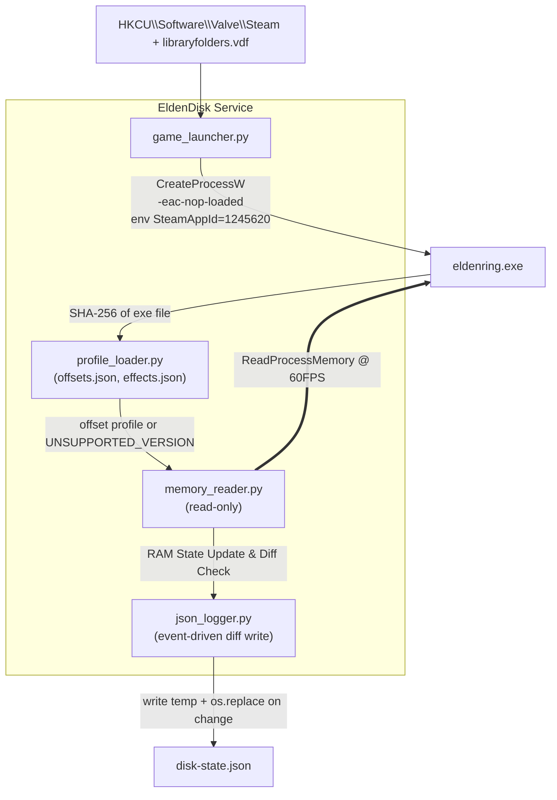

# EldenDisk Telemetry Tool
> **Proof of Concept (PoC) Specification**
> **Document Version:** 1.4.0 (revised from 1.3.0)
> **Date of Issue:** 2026-10-03
> **Target Platform:** Windows 10 / 11 (x64), Python 3.11+ (64-bit)
> **Game:** Elden Ring (Steam). Supported exe versions are listed in `offsets.json` (see §4.1)

---

## 0. Changelog

### 1.3.0 → 1.4.0

| **#** | **Change** | **Reason** |
|:-----:|:-----------|:-----------|
|   1   | Retain `character` State on `DISCONNECTED` | Retains last known `<full-object>` character data in `disk-state.json` when game process exits instead of reverting to `null`. |
|   2   | Expanded `runes` Data Structure | Transformed `character.runes` from a single `uint32` integer into an object containing `total`, `baseline`, and `delta`. Baseline is reset and frozen (`baseline = total`) on Initial Connect and on entering Site of Grace (detected via Animation ID `68011` at `PlayerIns + 0x190 -> +0x18 -> +0x90`). |
|   3   | Removed Top-Level `telemetry` Object | Streamlined JSON output by removing the now redundant top-level `telemetry` block (`session_start_runes`, `rune_delta`). |

---

## 1. Executive Summary

A lightweight, **read-only** memory read tool featuring an **Event-Driven Persistence Architecture** for **offline** Elden Ring sessions:

```text
[LAUNCH] → [READ MEMORY AND UPDATE STATE (In RAM) @ 60FPS LOCKED] → [JSON WRITE (To Disk)]
```

### Guarantees
1. **Offline only.** The game is started by running `eldenring.exe -eac-nop-loaded` directly. EAC is not loaded and online play is unavailable. The tool refuses to attach to any process it did not launch or that shows EAC modules loaded (§3.4).
2. **Read-only.** Only `PROCESS_VM_READ | PROCESS_QUERY_LIMITED_INFORMATION` is requested. No `WriteProcessMemory`, `VirtualAllocEx`, `CreateRemoteThread`, or injection.
3. **Zero disk changes in the game folder.** No file is created, modified, renamed, or deleted there. (Reading `eldenring.exe` to hash it is read-only.)
4. **Correct-or-silent.** If the exe version is unknown or any validation fails, the tool reports a status and emits **no** character data.
5. **Resource-conscious (Event-Driven Persistence).** Memory read loops run in RAM locked at 60FPS. Disk writes are strictly event-driven—triggered only when data state changes or when active timed timers update.

---

## 2. Architecture



---

## 3. Offline Launcher

### 3.1 Command
```cmd
"<GameDir>\eldenring.exe" -eac-nop-loaded
```
`<GameDir>` is `...\steamapps\common\ELDEN RING\Game`.

### 3.2 Discovery
1. Read `HKCU\Software\Valve\Steam\SteamPath`.
2. Parse `<SteamPath>\steamapps\libraryfolders.vdf` for all library paths.
3. Pick the library where `steamapps\common\ELDEN RING\Game\eldenring.exe` exists.
4. Steam client must already be running (required for Steam API init).

### 3.3 Process creation
- `CreateProcessW` with `lpApplicationName` = full exe path, `lpCommandLine` = `"eldenring.exe" -eac-nop-loaded`, `lpCurrentDirectory` = `<GameDir>`.
- Child environment: copy of current env plus `SteamAppId=1245620` and `SteamGameId=1245620`. This satisfies Steam API init **without** creating `steam_appid.txt`.
- The PID returned by `CreateProcessW` is the game PID. The tool only attaches to this PID.

### 3.4 Safety checks before attaching
- Enumerate modules with `CreateToolhelp32Snapshot(TH32CS_SNAPMODULE | TH32CS_SNAPMODULE32, pid)`. If any module name contains `EasyAntiCheat`, abort with `EAC_DETECTED` and never read memory.
- If the user starts the game via Steam normally (EAC active), the tool must not attach. It reports `EAC_ACTIVE` and exits the read loop.

---

## 4. Memory Reading & Execution Pacing

### 4.1 Version pinning (`offsets.json`)
On attach, compute SHA-256 of `eldenring.exe` and look it up:

```json
{
  "profiles": {
    "<sha256-of-exe>": {
      "label": "ER <version>",
      "world_chr_man_rva": "0x........",
      "world_chr_man_to_player": "0x........",
      "player_to_game_data": "0x580",
      "player_to_sp_effect": "0x178",
      "game_data": { "level": "0x68", "runes": "0x6C", "attributes": "0x3C" },
      "sp_effect": { "head": "0x8", "entry": { "id": "0x..", "next": "0x..", "duration": "0x..", "timer": "0x..", "timer_mode": "elapsed|remaining" } },
      "animation": { "player_to_anim_module": "0x190", "offsets": ["0x18", "0x90"], "grace_anim_id": 68011 }
    }
  }
}
```

### 4.2 Pointer chain

```text
eldenring.exe base
 └─ + world_chr_man_rva ─────────────────► [WorldChrMan] ─────────────────► (RVA changes per version, in profile)
     └─ + world_chr_man_to_player ───────► [PlayerIns] ───────────────────► (changes per version, in profile)
         ├─ + 0x580 ─────────────────────► [PlayerGameData] ──────────────► (VERIFY)
         │     ├─ + 0x68  Level ─────────► (uint32) 
         │     ├─ + 0x6C  Runes ─────────► (uint32)
         │     └─ + 0x3C  Attributes ────► (8 × uint32)
         └─ + 0x178 ─────────────────────► [SpecialEffect] ───────────────► (VERIFY)
               └─ + 0x8 ─────────────────► head of linked list of entries
```

### 4.3 Field table

| **Field**      | **Parent**     | **Offset**                        | **Type** | **Valid range**      | **Status**  |
|:---------------|:---------------|:----------------------------------|:--------:|:---------------------|:-----------:|
| WorldChrMan    | module base    | profile `world_chr_man_rva`       |  ptr64   | non-null, user-space | per-version |
| PlayerIns      | WorldChrMan    | profile `world_chr_man_to_player` |  ptr64   | non-null, user-space | per-version |
| PlayerGameData | PlayerIns      | `+0x580`                          |  ptr64   | non-null, user-space |   VERIFY    |
| Level          | PlayerGameData | `+0x68`                           |  uint32  | 1–713                |   stable    |
| Runes          | PlayerGameData | `+0x6C`                           |  uint32  | 0–999,999,999        |   stable    |
| Vigor          | PlayerGameData | `+0x3C`                           |  uint32  | 1–99                 |   stable    |
| Mind           | PlayerGameData | `+0x40`                           |  uint32  | 1–99                 |   stable    |
| Endurance      | PlayerGameData | `+0x44`                           |  uint32  | 1–99                 |   stable    |
| Strength       | PlayerGameData | `+0x48`                           |  uint32  | 1–99                 |   stable    |
| Dexterity      | PlayerGameData | `+0x4C`                           |  uint32  | 1–99                 |   stable    |
| Intelligence   | PlayerGameData | `+0x50`                           |  uint32  | 1–99                 |   stable    |
| Faith          | PlayerGameData | `+0x54`                           |  uint32  | 1–99                 |   stable    |
| Arcane         | PlayerGameData | `+0x58`                           |  uint32  | 1–99                 |   stable    |

### 4.4 Special effects (linked list) & Refactored `effects` Object

Active effects are a **singly traversable linked list** starting at `SpecialEffect + head`.

Classification uses `effects.json` (flat key-value map keyed by SpEffect ID):
- **`kind: "PERMANENT"`**: Selected when `duration <= 0` or timer indicates an infinite effect (e.g., equipped Talisman). `times` is set to `null`.
- **`kind: "TIMED"`**: Selected when `duration > 0` and `remaining > 0`. Timing fields `buff_duration`, `max_duration`, and `last_activated_at` are populated.

### 4.5 60FPS Pacing & Window Active Focus Detection (`IDLE`)

1. **60FPS Locked Pacing**: Memory sampling is executed inside a loop locked at 60 executions per second (~16.67 ms per tick).
2. **Window Focus Check**: Before executing memory sampling, the tool inspects the active foreground window (`GetForegroundWindow` / `GetWindowThreadProcessId`).
   - If the game window is **NOT active** (out of focus), the tool enters `IDLE` state.
   - In `IDLE` state, memory reading and disk writing are frozen.
   - The JSON `character` block retains the last valid `<full-object>` data.
   - Once focus returns to the game window, normal polling resumes seamlessly.

### 4.6 Event-Driven Persistence Architecture

Rather than writing to disk unconditionally on every frame:
1. The tool updates telemetry state in RAM at 60FPS.
2. State Differential Check: The tool evaluates whether the newly generated state/document differs from the last written document.
3. Write Decision:
   - **Write to disk**: If any state field, attribute, rune value, active effect set, or state machine status changes.
   - **Write to disk (Timer exception)**: If an active effect is classified as `kind: "TIMED"` with an active `buff_duration` countdown ticking down (capped at 60FPS rate).
   - **Skip write**: If state is completely identical and no active timers are ticking.

---

## 5. Connection State Machine

| **State**                     | **Meaning**                                                  | **JSON `character`** |
|:------------------------------|:-------------------------------------------------------------|:--------------------:|
| `WAITING_FOR_PROCESS`         | Game not running                                             |        `null`        |
| `EAC_ACTIVE` / `EAC_DETECTED` | EAC present; tool refuses to attach                          |        `null`        |
| `UNSUPPORTED_VERSION`         | Exe hash not in `offsets.json`                               |        `null`        |
| `WAITING_FOR_WORLD`           | Process up but pointer chain is null (title screen, loading) |        `null`        |
| `CONNECTED`                   | All validations pass                                         |   `<full-object>`    |
| **`DISCONNECTED`**            | **Process exited**                                           | **`<full-object>`**  |
| `IDLE`                        | Game window is present but not in focus                      |   `<full-object>`    |

---

## 6. JSON Output

### 6.1 Schema (Draft 2020-12)

Top-level `telemetry` object is removed in version 1.4.0. `character.runes` is expanded into an object.

```json
{
  "$schema": "https://json-schema.org/draft/2020-12/schema",
  "title": "EldenDiskLiveState",
  "type": "object",
  "required": ["system_status", "character"],
  "properties": {
    "system_status": {
      "type": "object",
      "required": ["state", "game_connected", "pid", "anti_cheat_status", "read_only", "exe_sha256", "profile", "buffs_supported", "ignored_effects", "last_error"],
      "properties": {
        "state": {
          "type": "string",
          "enum": ["WAITING_FOR_PROCESS", "EAC_ACTIVE", "EAC_DETECTED", "UNSUPPORTED_VERSION", "WAITING_FOR_WORLD", "CONNECTED", "DISCONNECTED", "IDLE"]
        },
        "game_connected": { "type": "boolean" },
        "pid": { "type": ["integer", "null"] },
        "anti_cheat_status": { "type": "string", "enum": ["DISABLED_OFFLINE", "ACTIVE_EAC", "UNKNOWN"] },
        "read_only": { "type": "boolean", "const": true },
        "exe_sha256": { "type": ["string", "null"] },
        "profile": { "type": ["string", "null"] },
        "buffs_supported": { "type": "boolean" },
        "ignored_effects": { "type": "integer", "minimum": 0 },
        "last_error": { "type": ["string", "null"] }
      }
    },
    "character": {
      "type": ["object", "null"],
      "required": ["level", "runes", "attributes", "effects"],
      "properties": {
        "level": { "type": "integer", "minimum": 1, "maximum": 713 },
        "runes": {
          "type": "object",
          "required": ["total", "baseline", "delta"],
          "properties": {
            "total": { "type": "integer", "minimum": 0, "maximum": 999999999 },
            "baseline": { "type": "integer", "minimum": 0, "maximum": 999999999 },
            "delta": { "type": "integer" }
          }
        },
        "attributes": {
          "type": "object",
          "required": ["vigor", "mind", "endurance", "strength", "dexterity", "intelligence", "faith", "arcane"],
          "additionalProperties": { "type": "integer", "minimum": 1, "maximum": 99 }
        },
        "effects": {
          "type": "object",
          "additionalProperties": {
            "type": "object",
            "required": ["name", "kind", "times"],
            "properties": {
              "name": { "type": "string" },
              "kind": { "type": "string", "enum": ["TIMED", "PERMANENT"] },
              "category": { "type": "string" },
              "ability": { "type": "string" },
              "times": {
                "anyOf": [
                  {
                    "type": "object",
                    "required": ["buff_duration", "max_duration", "last_activated_at"],
                    "properties": {
                      "buff_duration": { "type": ["number", "null"], "minimum": 0 },
                      "max_duration": { "type": ["number", "null"], "exclusiveMinimum": 0 },
                      "last_activated_at": { "type": ["string", "null"], "format": "date-time" }
                    }
                  },
                  { "type": "null" }
                ]
              }
            }
          }
        }
      }
    }
  }
}
```

### 6.2 Example Output

```json
{
  "system_status": {
    "state": "CONNECTED",
    "game_connected": true,
    "pid": 14208,
    "anti_cheat_status": "DISABLED_OFFLINE",
    "read_only": true,
    "exe_sha256": "1a3547101327f65d0c76da2f9190ac0aa66871ea42bae2aecc61e11a8b597891",
    "profile": "ER 1.17.1",
    "buffs_supported": true,
    "ignored_effects": 37,
    "last_error": null
  },
  "character": {
    "level": 386,
    "runes": {
      "total": 1050000,
      "baseline": 1000000,
      "delta": 50000
    },
    "attributes": {
      "vigor": 80,
      "mind": 60,
      "endurance": 60,
      "strength": 90,
      "dexterity": 90,
      "intelligence": 15,
      "faith": 60,
      "arcane": 10
    },
    "effects": {
      "311100": {
        "name": "Gold Scarab",
        "kind": "PERMANENT",
        "category": "TALISMANS",
        "ability": "Permanently increases Runes gained by 20% while equipped.",
        "times": null
      },
      "3971": {
        "name": "Gold-Pickled Fowl Foot",
        "kind": "TIMED",
        "category": "CONSUMABLES",
        "ability": "Increases Runes gained by 30% for 3 minutes.",
        "times": {
          "buff_duration": 67.16,
          "max_duration": 180.0,
          "last_activated_at": "2026-09-30T14:36:15.598Z"
        }
      }
    }
  }
}
```

---

## 7. CLI Commands Reference

CLI command name is `eldendisk.exe` (or `python -m eldendisk`):
- **`eldendisk.exe hash`**
- **`eldendisk.exe run -v`**
- **`eldendisk.exe run --attach`**
- **`eldendisk.exe effects -q`**

Default sampling rate for `run` is `--hz 60.0`.
