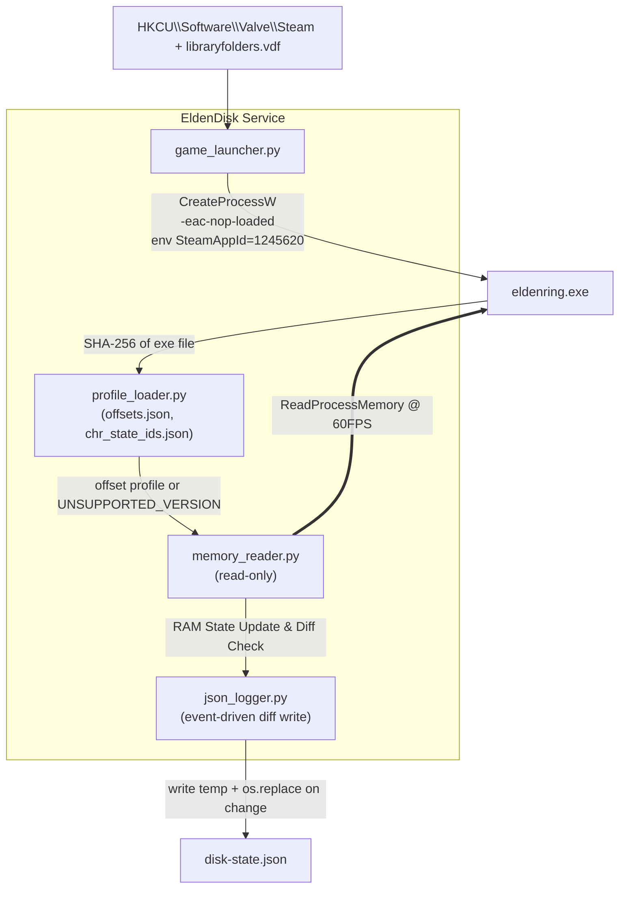

# EldenDisk Telemetry Tool
> **Proof of Concept (PoC) Specification**
> **Document Version:** 1.4.1 (revised from 1.4.0)
> **Date of Issue:** 2026-10-04
> **Target Platform:** Windows 10 / 11 (x64), Python 3.11+ (64-bit)
> **Game:** Elden Ring (Steam). Supported exe versions are listed in `offsets.json` (see §4.1)

---

## 0. Changelog

### 1.4.0 → 1.4.1

| **#** | **Change** | **Reason** |
|:-----:|:-----------|:-----------|
|   1   | Single Source of Truth Configuration (`chr_state_ids.json`) | Replaced legacy `effects.json` with `chr_state_ids.json` as the unified source of truth for both SpEffect IDs and Animation State IDs, incorporating `sources`, `categories`, and `abilities` metadata. |
|   2   | Restructured `character.effects` Output Payload | Omitted the `kind` field from final JSON output. Pluralized metadata keys to `categories` and `abilities`. The `times` object is populated strictly for `TIMED` effects and omitted completely (instead of emitting `null`) for `PERMANENT` effects. |
|   3   | Added Real-Time Animation Tracking (`character.animations`) | Added `character.animations` tracking to JSON output. Holds strictly one active animation state ID mapped to its metadata from `chr_state_ids.json`, remaining frozen on the last active state until overridden. |
|   4   | Animation Live-Monitor CLI Command (`animations`) | Implemented `python -m eldendisk animations -q` CLI command for real-time tracking and logging of character animation state IDs with timestamp formatting. |

---

## 1. Executive Summary

A lightweight, **read-only** memory read tool featuring an **Event-Driven Persistence Architecture** for **offline** Elden Ring sessions:

```text
[LAUNCH] → [READ MEMORY AND UPDATE STATE (In RAM) @ 60FPS LOCKED] → [JSON WRITE (To Disk)]
```

### Guarantees
1. **Offline only.** The game is started by running `eldenring.exe -eac-nop-loaded` directly. EAC is not loaded and online play is unavailable. The tool refuses to attach to any process it did not launch or that shows EAC modules loaded (§3.4).
2. **Read-only.** Only `PROCESS_VM_READ | PROCESS_QUERY_LIMITED_INFORMATION` is requested. No `WriteProcessMemory`, `VirtualAllocEx`, `CreateRemoteThread`, or injection.
3. **Zero disk changes in the game folder.** No file is created, modified, renamed, or deleted there. (Reading `eldenring.exe` to hash it is read-only.)
4. **Correct-or-silent.** If the exe version is unknown or any validation fails, the tool reports a status and emits **no** character data.
5. **Resource-conscious (Event-Driven Persistence).** Memory read loops run in RAM locked at 60FPS. Disk writes are strictly event-driven—triggered only when data state changes or when active timed timers update.

---

## 2. Architecture



---

## 3. Offline Launcher

### 3.1 Command
```cmd
"<GameDir>\eldenring.exe" -eac-nop-loaded
```
`<GameDir>` is `...\steamapps\common\ELDEN RING\Game`.

### 3.2 Discovery
1. Read `HKCU\Software\Valve\Steam\SteamPath`.
2. Parse `<SteamPath>\steamapps\libraryfolders.vdf` for all library paths.
3. Pick the library where `steamapps\common\ELDEN RING\Game\eldenring.exe` exists.
4. Steam client must already be running (required for Steam API init).

### 3.3 Process creation
- `CreateProcessW` with `lpApplicationName` = full exe path, `lpCommandLine` = `"eldenring.exe" -eac-nop-loaded`, `lpCurrentDirectory` = `<GameDir>`.
- Child environment: copy of current env plus `SteamAppId=1245620` and `SteamGameId=1245620`.
- The PID returned by `CreateProcessW` is the game PID. The tool only attaches to this PID.

### 3.4 Safety checks before attaching
- Enumerate modules with `CreateToolhelp32Snapshot(TH32CS_SNAPMODULE | TH32CS_SNAPMODULE32, pid)`. If any module name contains `EasyAntiCheat`, abort with `EAC_DETECTED` and never read memory.
- If the user starts the game via Steam normally (EAC active), the tool must not attach. It reports `EAC_ACTIVE` and exits the read loop.

---

## 4. Configuration & Memory Reading

### 4.1 Unified State Configuration (`chr_state_ids.json`)
The configuration file `chr_state_ids.json` acts as the single source of truth for all mapped SpEffect IDs and Animation State IDs:

#### Key-Value Data Specification

| Field | Type | Mandatory | Description | Example |
|:---|:---:|:---:|:---|:---|
| `name` | `string` | ✔ | In-game state or specific entity name | `Gold-Pickled Fowl Foot` |
| `sources` | `enum` | ✔ | In-game offset source derived from verification | `EFFECTS` |
| `categories` | `enum` | ✔ | In-game category classification | `CONSUMABLES` |
| `abilities` | `string` | | In-game description of state effects / abilities | `Increases Runes gained by 30% for 3 minutes.` |

#### `sources` Enum Definitions

| **Enum** | **Definition** |
|:---|:---|
| `EFFECTS` | Effect State Verification |
| `ANIMATIONS` | Animation State Verification |

#### `categories` Enum Definitions

| **Enum** | **Definition** |
|:---|:---|
| `CONSUMABLES` | Temporary effect states applied by consuming standard items. |
| `PERFUME_BOTTLES` | Temporary effect states applied by using crafted perfume items. |
| `FLASK_OF_WONDROUS_PHYSICK` | Temporary effect states applied by drinking the mixed Physick flask. |
| `GREASES` | Temporary effect states applied directly to weapons via greases. |
| `INCANTATIONS` | Effect states applied by casting Faith-based incantation spells. |
| `SORCERIES` | Effect states applied by casting Intelligence-based sorcery spells. |
| `ASHES_OF_WAR` | Effect states applied by activating weapon skills (Weapon Arts). |
| `TALISMANS` | Permanent passive effect states granted by equipped talismans. |
| `ARMOR_WITH_SPECIAL_EFFECTS` | Permanent passive effect states granted by specific equipped armor pieces. |
| `PASSIVE_WEAPON_BUFFS` | Permanent passive effect states granted by holding or equipping specific weapons. |
| `GREAT_RUNES` | Semi-permanent effect states granted by an active Great Rune until death. |
| `MANNER` | Specific character physical actions, stances, or animation states. |

#### Example `chr_state_ids.json`

```json
{
  "311100": {
    "name": "Gold Scarab",
    "sources": "EFFECTS",
    "categories": "TALISMANS",
    "abilities": "Permanently increases Runes gained by 20% while equipped."
  },
  "3971": {
    "name": "Gold-Pickled Fowl Foot",
    "sources": "EFFECTS",
    "categories": "CONSUMABLES",
    "abilities": "Increases Runes gained by 30% for 3 minutes."
  },
  "2020210": {
    "name": "Sprint",
    "sources": "ANIMATIONS",
    "categories": "MANNER"
  },
  "27110": {
    "name": "Dodge",
    "sources": "ANIMATIONS",
    "categories": "MANNER",
    "abilities": "Provides invincibility frames (i-frames) for a few milliseconds."
  },
  "68011": {
    "name": "Resting",
    "sources": "ANIMATIONS",
    "categories": "MANNER",
    "abilities": "Resets: HP, FP, Stamina, etc."
  }
}
```

### 4.2 Version Pinning (`offsets.json`)

```json
{
  "profiles": {
    "<sha256-of-exe>": {
      "label": "ER <version>",
      "world_chr_man_rva": "0x........",
      "world_chr_man_to_player": "0x........",
      "player_to_game_data": "0x580",
      "player_to_sp_effect": "0x178",
      "game_data": { "level": "0x68", "runes": "0x6C", "attributes": "0x3C" },
      "sp_effect": { "head": "0x8", "entry": { "id": "0x..", "next": "0x..", "duration": "0x..", "timer": "0x..", "timer_mode": "elapsed|remaining" } },
      "anim": {
        "player_to_modules": "0x190",
        "modules_to_time_act": "0x18",
        "time_act_read_idx": "0xC4",
        "time_act_queue": "0x20",
        "queue_entry_size": "0x10"
      },
      "at_grace": { "source": "anim", "equals": ["0x109AB"] }
    }
  }
}
```

### 4.3 Pointer Chain & Character State Reading
- **Player Stats & Attributes:** Read from `PlayerGameData` via `PlayerIns + 0x580`.
- **Special Effects:** Read linked list starting at `PlayerIns + 0x178 + head`. Omit internal `kind` field from final payload. If `TIMED`, append `times` object; if `PERMANENT`, omit `times` completely.
- **Animation State:** Read active animation ID from `CSChrTimeActModule` via `PlayerIns + 0x190` -> `+0x18` -> `read_idx (+0xC4)` -> `queue (+0x20 + read_idx * 0x10)`. Look up in `chr_state_ids.json`. Strictly 1:1 key-value map under `character.animations`, frozen on the last active state until overridden.

---

## 5. Connection State Machine

| **State**                     | **Meaning**                                                  | **JSON `character`** |
|:------------------------------|:-------------------------------------------------------------|:--------------------:|
| `WAITING_FOR_PROCESS`         | Game not running                                             |        `null`        |
| `EAC_ACTIVE` / `EAC_DETECTED` | EAC present; tool refuses to attach                          |        `null`        |
| `UNSUPPORTED_VERSION`         | Exe hash not in `offsets.json`                               |        `null`        |
| `WAITING_FOR_WORLD`           | Process up but pointer chain is null (title screen, loading) |        `null`        |
| `CONNECTED`                   | All validations pass                                         |   `<full-object>`    |
| **`DISCONNECTED`**            | **Process exited**                                           | **`<full-object>`**  |
| `IDLE`                        | Game window is present but not in focus                      |   `<full-object>`    |

---

## 6. JSON Output Schema (v1.4.1)

### 6.1 Schema (Draft 2020-12)

```json
{
  "$schema": "https://json-schema.org/draft/2020-12/schema",
  "title": "EldenDiskLiveState",
  "type": "object",
  "required": ["system_status", "character"],
  "properties": {
    "system_status": {
      "type": "object",
      "required": ["state", "game_connected", "pid", "anti_cheat_status", "read_only", "exe_sha256", "profile", "buffs_supported", "ignored_effects", "last_error"],
      "properties": {
        "state": {
          "type": "string",
          "enum": ["WAITING_FOR_PROCESS", "EAC_ACTIVE", "EAC_DETECTED", "UNSUPPORTED_VERSION", "WAITING_FOR_WORLD", "CONNECTED", "DISCONNECTED", "IDLE"]
        },
        "game_connected": { "type": "boolean" },
        "pid": { "type": ["integer", "null"] },
        "anti_cheat_status": { "type": "string", "enum": ["DISABLED_OFFLINE", "ACTIVE_EAC", "UNKNOWN"] },
        "read_only": { "type": "boolean", "const": true },
        "exe_sha256": { "type": ["string", "null"] },
        "profile": { "type": ["string", "null"] },
        "buffs_supported": { "type": "boolean" },
        "ignored_effects": { "type": "integer", "minimum": 0 },
        "last_error": { "type": ["string", "null"] }
      }
    },
    "character": {
      "type": ["object", "null"],
      "required": ["level", "runes", "attributes", "effects", "animations"],
      "properties": {
        "level": { "type": "integer", "minimum": 1, "maximum": 713 },
        "runes": {
          "type": "object",
          "required": ["total", "baseline", "delta"],
          "properties": {
            "total": { "type": "integer", "minimum": 0, "maximum": 999999999 },
            "baseline": { "type": "integer", "minimum": 0, "maximum": 999999999 },
            "delta": { "type": "integer" }
          }
        },
        "attributes": {
          "type": "object",
          "required": ["vigor", "mind", "endurance", "strength", "dexterity", "intelligence", "faith", "arcane"],
          "additionalProperties": { "type": "integer", "minimum": 1, "maximum": 99 }
        },
        "effects": {
          "type": "object",
          "additionalProperties": {
            "type": "object",
            "required": ["name", "categories"],
            "properties": {
              "name": { "type": "string" },
              "categories": { "type": "string" },
              "abilities": { "type": "string" },
              "times": {
                "type": "object",
                "required": ["buff_duration", "max_duration", "last_activated_at"],
                "properties": {
                  "buff_duration": { "type": ["number", "null"], "minimum": 0 },
                  "max_duration": { "type": ["number", "null"], "exclusiveMinimum": 0 },
                  "last_activated_at": { "type": ["string", "null"] }
                }
              }
            }
          }
        },
        "animations": {
          "type": "object",
          "additionalProperties": {
            "type": "object",
            "required": ["name", "categories"],
            "properties": {
              "name": { "type": "string" },
              "categories": { "type": "string" },
              "abilities": { "type": "string" }
            }
          }
        }
      }
    }
  }
}
```

### 6.2 Example Output

```json
{
  "system_status": {
    "state": "CONNECTED",
    "game_connected": true,
    "pid": 14208,
    "anti_cheat_status": "DISABLED_OFFLINE",
    "read_only": true,
    "exe_sha256": "1a3547101327f65d0c76da2f9190ac0aa66871ea42bae2aecc61e11a8b597891",
    "profile": "ER 1.17.1",
    "buffs_supported": true,
    "ignored_effects": 37,
    "last_error": null
  },
  "character": {
    "level": 386,
    "runes": {
      "total": 1050000,
      "baseline": 1000000,
      "delta": 50000
    },
    "attributes": {
      "vigor": 80,
      "mind": 60,
      "endurance": 60,
      "strength": 90,
      "dexterity": 90,
      "intelligence": 15,
      "faith": 60,
      "arcane": 10
    },
    "effects": {
      "311100": {
        "name": "Gold Scarab",
        "categories": "TALISMANS",
        "abilities": "Permanently increases Runes gained by 20% while equipped."
      },
      "3971": {
        "name": "Gold-Pickled Fowl Foot",
        "categories": "CONSUMABLES",
        "abilities": "Increases Runes gained by 30% for 3 minutes.",
        "times": {
          "buff_duration": 67.16,
          "max_duration": 180.0,
          "last_activated_at": "2026-09-30 14:36:15.598000"
        }
      }
    },
    "animations": {
      "2020210": {
        "name": "Sprint",
        "categories": "MANNER"
      }
    }
  }
}
```

---

## 7. CLI Commands Reference

CLI command name is `eldendisk.exe` (or `python -m eldendisk`):
- **`eldendisk.exe hash`**
- **`eldendisk.exe run -v`**
- **`eldendisk.exe run --attach`**
- **`eldendisk.exe effects -q`**
- **`eldendisk.exe animations -q`**
