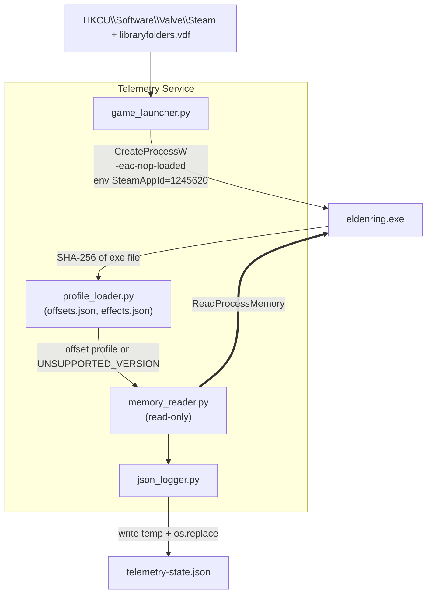

# Elden Ring Telemetry Tool
> **Proof of Concept (PoC) Specification**
> **Document Version:** 1.2.1 (revised from 1.2.0)
> **Date of Issue:** 2026-09-30
> **Target Platform:** Windows 10 / 11 (x64), Python 3.11+ (64-bit)
> **Game:** Elden Ring (Steam). Supported exe versions are listed in `offsets.json` (see §4.1)

---

## 0. Changelog

### 1.2.0 → 1.2.1

| # | Change | Reason |
|---|---|---|
| 1 | Merged `active_buffs` and `passive_buffs` into a single `effects` map in `character` | Both active and passive buffs represent character status effects originating from the same status bar. Unifying them simplifies telemetry parsing. |
| 2 | Introduced `kind` field (`"TIMED"` / `"PERMANENT"`) and nested time metadata in a `times` object | Clean separation between effect type classification and timing details (`buff_duration`, `max_duration`, `last_activated_at`). |
| 3 | Restructured `effects.json` into a flat key-value object map keyed by SpEffect ID | Eliminates separate top-level `"active"` and `"passive"` blocks in favor of unified lookup metadata (`name`, `category`, `ability`). |
| 4 | Renamed `activation_timestamp_iso` to `last_activated_at` and ensured stable persistence | Once a `TIMED` object's `last_activated_at` is set, it remains unchanged until the player uses it again or re-casts it. When `buff_duration` times out, it is removed from the set. |

### 1.1.0 → 1.2.0

| # | Change | Reason |
|---|---|---|
| 1 | §7 rewritten with steps, commands, reference outputs (ER 1.17.1) and pass/fail rules for every check | The checklist said *what* to verify but not *how* |
| 2 | Added profile status **PROVISIONAL** (V-01..V-05) vs **VERIFIED** (V-01..V-06) and a sign-off table (§7.8) | The reference profile passed V-01..V-05 but V-06 is still open |
| 3 | V-03 split into **V-03a** (exact match) and **V-03b** (single-attribute increment) | Repeated attribute values (e.g. mind = endurance = faith) hide swapped offsets |
| 4 | V-02 now records behaviour on the title screen instead of assuming "null" | Not yet observed for quit-to-title |
| 5 | New helper `tools\soak_check.py` for V-06; `run --attach` and `effects [-q]` documented in §7.0 | These commands exist in the implementation but were not in the spec |

---

## 1. Executive Summary

A lightweight, **read-only** telemetry service for **offline** Elden Ring sessions:

```
[ Offline Launcher ] → [ Read-Only Memory Reader (version-pinned) ] → [ JSON Telemetry Output ]
```

### Guarantees
1. **Offline only.** The game is started by running `eldenring.exe -eac-nop-loaded` directly. EAC is not loaded and online play is unavailable. The tool refuses to attach to any process it did not launch or that shows EAC modules loaded (§3.4).
2. **Read-only.** Only `PROCESS_VM_READ | PROCESS_QUERY_LIMITED_INFORMATION` is requested. No `WriteProcessMemory`, `VirtualAllocEx`, `CreateRemoteThread`, or injection.
3. **Zero disk changes in the game folder.** No file is created, modified, renamed, or deleted there. (Reading `eldenring.exe` to hash it is read-only.)
4. **Correct-or-silent.** If the exe version is unknown or any validation fails, the tool reports a status and emits **no** character data.

---

## 2. Architecture



---

## 3. Offline Launcher

### 3.1 Command
```cmd
"<GameDir>\eldenring.exe" -eac-nop-loaded
```
`<GameDir>` is `...\steamapps\common\ELDEN RING\Game`.

### 3.2 Discovery
1. Read `HKCU\Software\Valve\Steam\SteamPath`.
2. Parse `<SteamPath>\steamapps\libraryfolders.vdf` for all library paths.
3. Pick the library where `steamapps\common\ELDEN RING\Game\eldenring.exe` exists.
4. Steam client must already be running (required for Steam API init).

### 3.3 Process creation
- `CreateProcessW` with `lpApplicationName` = full exe path, `lpCommandLine` = `"eldenring.exe" -eac-nop-loaded`, `lpCurrentDirectory` = `<GameDir>`.
- Child environment: copy of current env plus `SteamAppId=1245620` and `SteamGameId=1245620`. This satisfies Steam API init **without** creating `steam_appid.txt`.
- The PID returned by `CreateProcessW` is the game PID. The tool only attaches to this PID.
- **Fallback (only if V-01 fails):** the user creates `steam_appid.txt` manually; the tool itself never writes to the game folder.

### 3.4 Safety checks before attaching
- Enumerate modules with `CreateToolhelp32Snapshot(TH32CS_SNAPMODULE | TH32CS_SNAPMODULE32, pid)`. If any module name contains `EasyAntiCheat`, abort with `EAC_DETECTED` and never read memory.
- If the user starts the game via Steam normally (EAC active), the tool must not attach. It reports `EAC_ACTIVE` and exits the read loop.

---

## 4. Memory Reading

### 4.1 Version pinning (`offsets.json`)
On attach, compute SHA-256 of `eldenring.exe` and look it up:

```json
{
  "profiles": {
    "<sha256-of-exe>": {
      "label": "ER <version>",
      "world_chr_man_rva": "0x........",
      "world_chr_man_to_player": "0x........",
      "player_to_game_data": "0x580",
      "player_to_sp_effect": "0x178",
      "game_data": { "level": "0x68", "runes": "0x6C", "attributes": "0x3C" },
      "sp_effect": { "head": "0x8", "entry": { "id": "0x..", "next": "0x..", "duration": "0x..", "timer": "0x..", "timer_mode": "elapsed|remaining" } }
    }
  }
}
```

---

### 4.2 Pointer chain

```text
eldenring.exe base
 └─ + world_chr_man_rva ─────────► [WorldChrMan]              (RVA changes per version, in profile)
     └─ + world_chr_man_to_player ─► [PlayerIns]              (changes per version, in profile)
         ├─ + 0x580 ─► [PlayerGameData]                       (VERIFY)
         │     ├─ + 0x68  Level    (uint32)
         │     ├─ + 0x6C  Runes    (uint32)
         │     └─ + 0x3C  Attributes (8 × uint32)
         └─ + 0x178 ─► [SpecialEffect]                        (VERIFY)
               └─ + 0x8 ─► head of linked list of entries
```

---

### 4.3 Field table

| Field | Parent | Offset | Type | Valid range | Status |
|---|---|---|---|---|---|
| WorldChrMan | module base | profile `world_chr_man_rva` | ptr64 | non-null, user-space | per-version |
| PlayerIns | WorldChrMan | profile `world_chr_man_to_player` | ptr64 | non-null, user-space | per-version |
| PlayerGameData | PlayerIns | `+0x580` | ptr64 | non-null, user-space | VERIFY |
| Level | PlayerGameData | `+0x68` | uint32 | 1–713 | stable |
| Runes | PlayerGameData | `+0x6C` | uint32 | 0–999,999,999 | stable |
| Vigor | PlayerGameData | `+0x3C` | uint32 | 1–99 | stable |
| Mind | PlayerGameData | `+0x40` | uint32 | 1–99 | stable |
| Endurance | PlayerGameData | `+0x44` | uint32 | 1–99 | stable |
| Strength | PlayerGameData | `+0x48` | uint32 | 1–99 | stable |
| Dexterity | PlayerGameData | `+0x4C` | uint32 | 1–99 | stable |
| Intelligence | PlayerGameData | `+0x50` | uint32 | 1–99 | stable |
| Faith | PlayerGameData | `+0x54` | uint32 | 1–99 | stable |
| Arcane | PlayerGameData | `+0x58` | uint32 | 1–99 | stable |

---

### 4.4 Special effects (linked list) & Refactored `effects` Object

Active effects are a **singly traversable linked list** starting at `SpecialEffect + head`. Each entry provides at least: SpEffect param ID, a timer value, a total duration, and a `next` pointer.

Traversal rules (all mandatory):
1. Stop when `next == 0`.
2. Hard cap of **512** entries per sample.
3. Cycle detection: stop if a pointer repeats.
4. Every pointer must be in user space (`0x10000 ≤ p < 0x7FFFFFFF0000`) and readable, otherwise abort the sample.

**Classification uses `effects.json` (flat key-value map keyed by SpEffect ID):**
```json
{
  "311100": {
    "name": "Gold Scarab",
    "category": "TALISMANS",
    "ability": "Permanently increases Runes gained by 20% while equipped."
  },
  "3971": {
    "name": "Gold-Pickled Fowl Foot",
    "category": "CONSUMABLES",
    "ability": "Increases Runes gained by 30% for 3 minutes."
  }
}
```

- Each present SpEffect ID found in memory that matches a key in `effects.json` is mapped into the `character.effects` object set:
  - **`kind: "PERMANENT"`**: Selected when `duration <= 0` or timer indicates an infinite effect (e.g. equipped Talisman). Timing fields in `times` are set to `null`.
  - **`kind: "TIMED"`**: Selected when `duration > 0` and `remaining > 0`. Timing fields `buff_duration`, `max_duration`, and `last_activated_at` are populated. 
    - Gimmick 1: When a `TIMED` effect's `buff_duration` times out (reaches <= 0), it is automatically removed from the `effects` set until activated again.
    - Gimmick 2: Once `last_activated_at` is set, it remains unchanged and stable across samples until re-cast or re-activated.
- Any ID not present in `effects.json` is counted in `system_status.ignored_effects`.

---

### 4.5 Read rules
- Every read goes through `ReadProcessMemory`; treat `ERROR_PARTIAL_COPY` (299) and short reads as "value unavailable", never as zero.
- Validate each pointer (non-null, user-space) and each value against its range. One failed check discards the **entire** sample.
- Polling rate: 10 Hz default (configurable 1–30 Hz).

---

### 4.6 Connection state machine

| State | Meaning | JSON `character` |
|---|---|---|
| `WAITING_FOR_PROCESS` | Game not running | `null` |
| `EAC_ACTIVE` / `EAC_DETECTED` | EAC present; tool refuses to attach | `null` |
| `UNSUPPORTED_VERSION` | Exe hash not in `offsets.json` | `null` |
| `WAITING_FOR_WORLD` | Process up but pointer chain is null (title screen, loading) | `null` |
| `CONNECTED` | All validations pass | full object |
| `DISCONNECTED` | Process exited | `null` |

---

## 5. JSON Output

### 5.1 Schema (Draft 2020-12)

```json
{
  "$schema": "https://json-schema.org/draft/2020-12/schema",
  "title": "EldenRingLiveTelemetry",
  "type": "object",
  "required": ["timestamp", "system_status", "character", "telemetry"],
  "properties": {
    "timestamp": { "type": "string", "format": "date-time" },
    "system_status": {
      "type": "object",
      "required": ["state", "game_connected", "pid", "anti_cheat_status", "read_only", "exe_sha256", "profile", "buffs_supported", "ignored_effects", "last_error"],
      "properties": {
        "state": {
          "type": "string",
          "enum": ["WAITING_FOR_PROCESS", "EAC_ACTIVE", "EAC_DETECTED", "UNSUPPORTED_VERSION", "WAITING_FOR_WORLD", "CONNECTED", "DISCONNECTED"]
        },
        "game_connected": { "type": "boolean" },
        "pid": { "type": ["integer", "null"] },
        "anti_cheat_status": { "type": "string", "enum": ["DISABLED_OFFLINE", "ACTIVE_EAC", "UNKNOWN"] },
        "read_only": { "type": "boolean", "const": true },
        "exe_sha256": { "type": ["string", "null"] },
        "profile": { "type": ["string", "null"] },
        "buffs_supported": { "type": "boolean" },
        "ignored_effects": { "type": "integer", "minimum": 0 },
        "last_error": { "type": ["string", "null"] }
      }
    },
    "character": {
      "type": ["object", "null"],
      "required": ["level", "runes", "attributes", "effects"],
      "properties": {
        "level": { "type": "integer", "minimum": 1, "maximum": 713 },
        "runes": { "type": "integer", "minimum": 0, "maximum": 999999999 },
        "attributes": {
          "type": "object",
          "required": ["vigor", "mind", "endurance", "strength", "dexterity", "intelligence", "faith", "arcane"],
          "additionalProperties": { "type": "integer", "minimum": 1, "maximum": 99 }
        },
        "effects": {
          "type": "object",
          "additionalProperties": {
            "type": "object",
            "required": ["name", "kind", "times"],
            "properties": {
              "name": { "type": "string" },
              "kind": { "type": "string", "enum": ["TIMED", "PERMANENT"] },
              "category": { "type": "string" },
              "ability": { "type": "string" },
              "times": {
                "type": "object",
                "required": ["buff_duration", "max_duration", "last_activated_at"],
                "properties": {
                  "buff_duration": { "type": ["number", "null"], "minimum": 0 },
                  "max_duration": { "type": ["number", "null"], "exclusiveMinimum": 0 },
                  "last_activated_at": { "type": ["string", "null"], "format": "date-time" }
                }
              }
            }
          }
        }
      }
    },
    "telemetry": {
      "type": "object",
      "required": ["session_start_runes", "rune_delta"],
      "properties": {
        "session_start_runes": { "type": ["integer", "null"] },
        "rune_delta": { "type": ["integer", "null"] }
      }
    }
  }
}
```

---

### 5.2 Example Output

```json
{
  "timestamp": "2026-09-30T14:36:15.598Z",
  "system_status": {
    "state": "CONNECTED",
    "game_connected": true,
    "pid": 14208,
    "anti_cheat_status": "DISABLED_OFFLINE",
    "read_only": true,
    "exe_sha256": "1a3547101327f65d0c76da2f9190ac0aa66871ea42bae2aecc61e11a8b597891",
    "profile": "ER 1.17.1",
    "buffs_supported": true,
    "ignored_effects": 37,
    "last_error": null
  },
  "character": {
    "level": 386,
    "runes": 10008626,
    "attributes": {
      "vigor": 80,
      "mind": 60,
      "endurance": 60,
      "strength": 90,
      "dexterity": 90,
      "intelligence": 15,
      "faith": 60,
      "arcane": 10
    },
    "effects": {
      "311100": {
        "name": "Gold Scarab",
        "kind": "PERMANENT",
        "category": "TALISMANS",
        "ability": "Permanently increases Runes gained by 20% while equipped.",
        "times": {
          "buff_duration": null,
          "max_duration": null,
          "last_activated_at": null
        }
      },
      "3971": {
        "name": "Gold-Pickled Fowl Foot",
        "kind": "TIMED",
        "category": "CONSUMABLES",
        "ability": "Increases Runes gained by 30% for 3 minutes.",
        "times": {
          "buff_duration": 67.16,
          "max_duration": 180.0,
          "last_activated_at": "2026-09-30T14:36:15.598Z"
        }
      }
    }
  },
  "telemetry": {
    "session_start_runes": 9500000,
    "rune_delta": 508626
  }
}
```

---

## 6. Safety Audit Checklist

| Domain | Standard | How it is enforced |
|---|---|---|
| Memory rights | `PROCESS_VM_READ \| PROCESS_QUERY_LIMITED_INFORMATION` only | Single `OpenProcess` call site; unit test asserts the flag mask |
| No writes | No `WriteProcessMemory`, injection, remote threads | Static grep in CI for forbidden API names |
| Game dir hygiene | Zero files created or changed | Test: hash-tree of game dir before and after a session must match |
| EAC | Never attach with EAC loaded | Module scan in §3.4 |
| Online | Offline launch only | `-eac-nop-loaded`; tool does not launch any other mode |
| Data integrity | No unverified data emitted | §4.5 validation and §4.6 state machine |

---

## 7. Verification Checklist

Refer to standard verification checklist V-01 through V-07. V-05 is updated to verify timing attributes within the unified `effects` object (`effects.<id>.times.buff_duration`).
